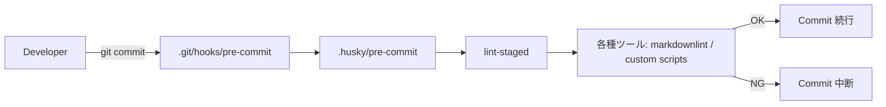

このガイドはNode.jsプロジェクト（単体/モノレポ両対応）を対象とし、GitフックをHuskyで一元管理し、コミットやプッシュ時の品質を自動担保することを目的とする。

---

## 0. TL;DR（最短セットアップ）

以下は、Huskyとlint-stagedを使った最短セットアップ手順である。

```sh
# 1) 依存導入
npm i -D husky lint-staged

# 2) Husky 初期化（.husky/ ディレクトリ作成）
npx husky init
# ← package.json に "prepare": "husky" が追記される（v9 以降）

# 3) pre-commit フック作成
cat > .husky/pre-commit <<'SH'
#!/bin/sh
. "$(dirname "$0")/_/husky.sh"

# ステージ済みファイルのみ lint-staged で処理
npx --no-install lint-staged || exit 1
SH
chmod +x .husky/pre-commit

# 4) lint-staged 設定（package.json 例）
#   → Markdown 自動整形 + Mermaid 構文検証（Mermaid 連携は後述）
```

---

## 1. Git hooks と Husky の関係

Git hooksとは、Gitが用意する`pre-commit`や`commit-msg`、`pre-push`といったイベント駆動のスクリプトである。従来、これらは`.git/hooks/`ディレクトリに直接シェルスクリプトを記述して利用されていたが、このディレクトリはVCSの管理外であるためチームでの共有が困難で、移植性にも課題があった。Huskyは、`.husky/`ディレクトリをリポジトリにコミットしてチームで共有し、`prepare`スクリプトを通じてGitのhooksPathに連携させることで、この問題を解決する仕組みである。

仕組みの要点として、`npm install`が実行されると`npm run prepare`が走り、Huskyが`.git/hooks/`内にランチャーを設置する。その後、各Gitフックがトリガーされると、対応する`.husky/<hook>`内のシェルが起動され、プロジェクトのNode.jsや関連ツールを使った検証処理が実行される流れとなる。



---

## 2. よく使うフックの実務パターン

実務では、各フックを役割分担させて利用することが多い。`pre-commit`フックでは、変更されたファイルに対してフォーマット、リンター、型チェック、軽量なユニットテストなど、即座にフィードバックできる処理を実行する。`commit-msg`フックは、Commitlintなどを用いてコミットメッセージが規約に沿っているかを検証する。`pre-push`フックでは、E2Eテストやビルドなど、より重量級の検証を必要に応じて行うが、処理時間が長すぎる場合はCIに委譲するのが賢明である。また、`post-merge`や`post-checkout`フックでは、依存関係の差分に応じた自動インストールや生成物の同期といった処理を自動化することも可能である。原則として、ローカルでのフックは高速な差分検証を中心に据え、重い全体チェックはCIに任せることで、開発者体験と品質保証のバランスを取ることが最適解となる。

---

## 3. lint-staged 連携の鉄板レシピ

lint-stagedは、「ステージング済みのファイルだけ」を対象に処理を高速実行することを目的としたツールである。

### package.json（例）

```json
{
  "lint-staged": {
    "*.{md,mdx}": [
      "markdownlint-cli2 --fix",
      "node scripts/check-mermaid.mjs"
    ],
    "*.{ts,tsx,js,jsx}": [
      "eslint --fix"
    ]
  }
}
```

> v10以降のlint-stagedは、タスクで変更されたファイルを自動で`git add`するため、配列の最後に`git add`を含める必要はない。

### .husky/pre-commit（例）

```sh
#!/bin/sh
. "$(dirname "$0")/_/husky.sh"

# 失敗したら commit を止める
npx --no-install lint-staged || exit 1
```

> `lint-staged`の設定で同じキーを重複定義した場合、後から定義したものが優先されるため、例えば`"*.md"`のようなキーは一箇所にまとめるべきである。

---

## 4. Mermaid 構文検証の組み込み（レシピ）

Mermaidチャートを含むMarkdown/MDXファイルの品質を`pre-commit`フックで担保するレシピを紹介する。

まず、`@mermaid-js/mermaid-cli`と`fast-glob`を開発依存としてインストールする。

```sh
npm i -D @mermaid-js/mermaid-cli fast-glob
```

次に、`scripts/check-mermaid.mjs`のような検証スクリプトを配置する。このスクリプトは、`docs/**/*.{md,mdx}`のような指定されたパスを対象とし、Markdownファイル内の`mermaid`コードフェンスを抽出する。抽出した内容は一時的な`.mmd`ファイルに保存され、`mmdc`コマンドで構文が検証される。検証に失敗した場合、スクリプトはファイル名、開始行番号、エラー要旨を出力して終了コード1で終了する。`MERMAID_CLI`環境変数が設定されていればそれが優先されるが、なければ`node_modules/.bin/mmdc`が自動的に解決される。

このスクリプトをlint-stagedと統合し、Markdownファイルがステージングされた際にのみ差分検証を実行する。

```json
{
  "lint-staged": {
    "*.{md,mdx}": [
      "markdownlint-cli2 --fix",
      "node scripts/check-mermaid.mjs"
    ]
  }
}
```

また、手動やCIで全ファイルをスキャンすることも可能である。`node scripts/check-mermaid.mjs docs`のように引数で対象ディレクトリを指定したり、`MERMAID_CLI`環境変数で実行バイナリを明示したりできる。

CI/CD環境、特にLinux上で`mmdc`を実行する場合、内部で利用されるPuppeteer（Chromium）がサンドボックス関連の問題で失敗することがある。その場合、公式のDockerイメージ（`ghcr.io/mermaid-js/mermaid-cli`）の利用を検討すると安定稼働が期待できる。

---

## 5. CI と Husky の棲み分け

ローカル環境とCI環境では、役割を明確に分けることが推奨される。ローカルでは`pre-commit`フックを用いて差分のみを高速に検証し、開発者へのフィードバックを迅速に行う。一方、CIではPull RequestやPushをトリガーとして全件チェックを行い、コードベース全体の品質を最終的に保証する。

### GitHub Actions（最小例: Markdown Lint）

```yaml
name: markdown
on:
  push:
    branches: [ main ]
    paths: [ '**/*.md', '.markdownlint*' ]
  pull_request:
    branches: [ main ]
    paths: [ '**/*.md', '.markdownlint*' ]
jobs:
  lint:
    runs-on: ubuntu-latest
    steps:
      - uses: actions/checkout@v4
      - uses: actions/setup-node@v4
        with:
          node-version: 'lts/*'
          cache: 'npm'
      - run: npx -y markdownlint-cli2 "**/*.md"
```

> このCIワークフローに`node scripts/check-mermaid.mjs docs`のような全件検証ステップを追加すれば、開発者がローカルでフックをスキップした場合でもエラーを確実に検出できる。

---

## 6. モノレポ（npm/pnpm/yarn workspaces）での運用

モノレポ環境でHuskyを運用する場合、リポジトリのルートに`.husky/`ディレクトリを配置し、ルートの`package.json`にある`prepare`スクリプトでHuskyを有効化するのが基本である。lint-stagedのコマンドは、`-w`フラグなどを用いてワークスペース全体を対象とし、ルートにインストールされたツールを呼び出す。もしパッケージごとに局所的な規約が異なる場合は、`apps/web/`のようなパスフィルターを用いて処理を分岐させる。pnpmを利用している場合、`pnpm dlx husky init`で初期化することも可能である。lint-stagedの実行は、ルートのバイナリを直接呼ぶなら`pnpm -w exec lint-staged`、ルートの`scripts`に定義したタスク経由なら`pnpm run -w lint-staged`のように記述する。

---

## 7. クロスプラットフォーム注意点

チーム開発では、異なるOSの挙動を考慮する必要がある。`.husky/`内のフックスクリプトは、特定のシェルに依存しないPOSIX `/bin/sh`ベースで記述するのが安全である。Windows環境ではGit Bashが`/bin/sh`を提供するため、PowerShell専用の記法は避けるべきである。また、フックスクリプトには`chmod +x .husky/*`コマンドで実行権限を付与し忘れないように注意が必要である。改行コードも問題を引き起こすことがあり、`.husky/`以下のファイルはLFで統一することが推奨される。CRLFは実行時エラーの原因となりうる。

---

## 8. 運用ポリシーとベストプラクティス

快適な開発体験と品質担保を両立させるには、いくつかの運用ポリシーが有効である。まず、`pre-commit`フックの処理は1～3秒程度で完了させ、重い処理は`pre-push`やCIに移行させることが「速いことは善」という原則に繋がる。次に、lint-stagedを用いて処理対象をステージング済みファイルのみに限定する「差分駆動」を徹底する。タスクの実行順序も重要で、コードフォーマッターなどによる自動整形（`--fix`）を先に行い、その後に構文検証を実行するべきである。CI環境などで一時的にフックを無効化したい場合は、`HUSKY=0`という環境変数を設定することでスキップできる。最後に、フックが失敗した際には、開発者が原因を即座に理解できるよう、明快なエラーメッセージと適切な終了コードを返すことが、優れた開発者体験に直結する。

---

## 9. トラブルシュート

フックの運用で問題が発生した場合、原因と対処法を知っておくと解決が早い。`husky: command not found`というエラーは、`devDependencies`がインストールされていない場合に発生するため、`npm ci`などを実行して`prepare`スクリプトが正しく動作するか確認する。フックが全く動かない場合、`.husky/`ディレクトリ内のスクリプトに実行権限がない可能性が高いので、`chmod +x .husky/*`で権限を付与する。何も起きないように見えるときは、`git config core.hooksPath`を確認し、他のツールによってhooksPathが上書きされていないか、またHusky管理下の`_`ディレクトリが存在するかをチェックする。Windowsでの実行失敗は、改行コードがCRLFになっているか、特定のシェルに依存した記述が原因であることが多い。`.husky/`内のファイルをLFに統一し、POSIX準拠のシェルで記述する。CIでのみ失敗する場合は、ローカルとCI環境でのNode.jsや依存パッケージのバージョン差異が考えられるため、`actions/setup-node`や`npm ci`を用いて環境の再現性を担保する。lint-stagedが意図せず全ファイルを対象にしてしまう現象は、設定のフィルタが間違っているか、`git add -A`を誤用しているケースが考えられる。globパターンを見直し、フック内での不要な`git add`を削除する。

---

## 10. セキュリティ/メンテ注意

Gitフックは強力な仕組みである一方、セキュリティとメンテナンス性にも配慮が必要である。フック内で`curl | sh`のように外部のスクリプトを直接実行するような実装は、セキュリティリスクを伴うため避けるべきである。自作の検証スクリプトは`scripts/`のような管理されたディレクトリに配置し、コードレビューの対象とすることが望ましい。また、APIトークンなどの機密情報をフック内で直接扱うべきではない。もし必要な場合は、環境変数経由で注入し、スクリプトのログに機密値が出力されないよう抑制するなどの対策を講じる。

---

## 付録A: サンプル `package.json`

```json
{
  "scripts": {
    "prepare": "husky",
    "precommit:mermaid": "node scripts/check-mermaid.mjs docs"
  },
  "lint-staged": {
    "*.{md,mdx}": [
      "markdownlint-cli2 --fix",
      "node scripts/check-mermaid.mjs"
    ]
  },
  "devDependencies": {
    "@mermaid-js/mermaid-cli": "^11.9.0",
    "husky": "^9.0.0",
    "lint-staged": "^15.0.0",
    "markdownlint-cli2": "^0.14.0"
  }
}
```

> ここに示す依存バージョンはあくまで一例である。特に`@mermaid-js/mermaid-cli`のように外部ツールに依存するものは、CI/CD環境での安定性を考慮し、最新版への追随を検討することが望ましい。

---

## 付録B: `.husky/pre-commit` 完全例

```sh
#!/bin/sh
. "$(dirname "$0")/_/husky.sh"

# 1) 変更ファイルに対して高速処理
npx --no-install lint-staged || exit 1

# 2) 任意: 明示的に全件 Mermaid を走らせたい場合（コメントアウト）
# npm run -s precommit:mermaid || exit 1
```

---

## 付録C: CI で Mermaid も検証する例

```yaml
name: docs-quality
on:
  pull_request:
    branches: [ main ]
    paths: [ 'docs/**', '**/*.md', 'scripts/check-mermaid.mjs' ]
  push:
    branches: [ main ]
    paths: [ 'docs/**', '**/*.md', 'scripts/check-mermaid.mjs' ]
jobs:
  check:
    runs-on: ubuntu-latest
    steps:
      - uses: actions/checkout@v4
      - uses: actions/setup-node@v4
        with:
          node-version: 'lts/*'
          cache: 'npm'
      - run: npm ci
      - run: npx -y markdownlint-cli2 "**/*.md"
      - run: node scripts/check-mermaid.mjs docs
```

---

## まとめ

Huskyは、Gitフックをチームで共有可能な形で運用するための標準的な解決策である。`pre-commit`フックとlint-stagedを組み合わせることで、処理対象をステージング済みの差分に絞り、開発体験を損なうことなく品質を担保できる。Mermaidの構文チェックのような分野特化の検証は、自作スクリプトをブロック化して組み込むことで、将来的な拡張も容易になる。ローカル環境では高速なフィードバックを重視し、CI環境では厳格な全体保証を行うという二段構えが、チーム開発における最適な戦略と言えるだろう。
