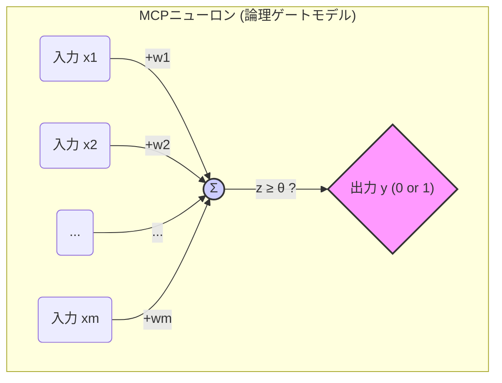
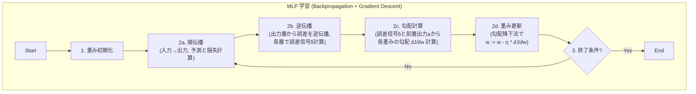

# 機械学習の原点 完全ガイド：パーセプトロンとADALINEから学ぶAIの基礎原理とPython実装

## 導入：なぜ今、半世紀前のアルゴリズムを学ぶのか？ 未来への羅針盤としての古典

私たちは今、人工知能（AI）が社会の風景を一変させつつある時代に生きています。特に**深層学習（Deep Learning）**と呼ばれる技術は、画像認識、自然言語処理、自動運転など、SFの世界を現実のものとしつつあります。これらの華々しい成果を目にすると、AIはまるで魔法のように感じられるかもしれません。

しかし、どんなに複雑に見える魔法にも、その根底にはシンプルで強力な原理が存在します。現代AIの目覚ましい進歩を支える技術の多くは、その基礎を、コンピュータサイエンスの黎明期、1950年代から60年代にかけて生まれた、驚くほどエレガントなアルゴリズムに置いています。本稿で徹底的に解剖する**パーセプトロン（Perceptron）**と**ADALINE（Adaptive Linear Neuron）**は、まさにその代表格であり、現代ニューラルネットワークの直接的な祖先にあたる存在です。

「なぜ、日進月歩のAI分野で、わざわざ半世紀以上も前の古いアルゴリズムを学ぶ必要があるのか？」――そう疑問に思う方もいるでしょう。答えは、**本質的な理解**にあります。最新技術の表面だけを追いかけても、その真の力や限界、そして未来の可能性を見通すことはできません。パーセプトロンやADALINEの仕組み、その数理的な裏付け、そして何ができて何ができなかったのかを深く理解することは、複雑な現代AIを「得体の知れないブラックボックス」としてではなく、その内部構造と基本原理を理解した「透明なホワイトボックス」として捉えるための、いわば**知的な解剖学の基礎**を身につけることに他なりません。

**本稿の対象読者と目標**

この記事は、AIや機械学習の世界に足を踏み入れたばかりの**初学者**の方々、あるいは基礎から体系的に学び直したいと考えている方々を主な対象としています。専門的な知識は前提としませんが、新しい概念を学ぶ意欲と、少しの数学（高校レベルの線形代数・微分の基礎があれば尚可）やプログラミング（Pythonの基本）への興味があれば十分です。

本稿の目標は、単にアルゴリズムの概要を説明することではありません。以下の達成を目指します。

*   パーセプトロンとADALINEが生まれた歴史的背景と、そのアイデアの根源を理解する。
*   これらのアルゴリズムの数学的な仕組み（数式とその意味）を、初学者にも分かるように丁寧に解説する。
*   Pythonを用いて実際にアルゴリズムを実装し、データを使って動かすことで、理論と実践を結びつける。
*   これらの古典的アルゴリズムの限界と、それがどのようにして現代のニューラルネットワークや深層学習へと発展していったのかの道筋を理解する。
*   機械学習における普遍的な重要概念（学習、損失関数、最適化、汎化、etc.）の基礎を固める。

**この記事のロードマップ**

この知的な探求の旅は、以下の章立てで進められます。

1.  **第1章：脳に学ぶ機械 ― 人工ニューロンの誕生**: AIの夢の原点と、生物の脳から着想を得た最初の計算モデルMCPニューロン。
2.  **第2章：パーセプトロン ― 「学習」する最初の機械**: 誤りから学ぶ画期的なアイデア、パーセプトロンの構造と学習規則。
3.  **第3章：手を動かして理解する ― Pythonでパーセプトロンを実装**: 実際にコードを書き、Irisデータセットでパーセプトロンを動かしてみる。
4.  **第4章：最適化への道筋 ― ADALINEと勾配降下法**: より洗練された学習へ。目的関数と勾配降下法の導入。
5.  **第5章：ADALINEの実装と実践 ― 特徴量スケーリングの重要性**: ADALINE(SGD)を実装し、実践における「罠」とその回避策を探る。
6.  **第6章：線形モデルの壁と未来 ― MLPと深層学習へ**: 線形モデルの限界を乗り越え、現代AIへと至る道筋。
7.  **第7章：より深く理解するために ― 理論的背景と実践Tips**: 汎化能力、モデル複雑性、そして実装上の注意点。

さあ、準備はいいですか？ 機械学習の原点を探る旅に出発しましょう。この旅を通じて、AIという壮大な建造物を支える、シンプルでありながら強固な基礎原理を発見できるはずです。

---

## 第1章：脳に学ぶ機械 ― 人工ニューロンの誕生

人間のように「考える」機械を作りたい――この夢は、古くから人類を魅了してきました。20世紀に入り、アラン・チューリングらが計算の理論的可能性を探求し、電子計算機が現実のものとなると、その夢は具体的な科学技術的挑戦へと姿を変えました。特に、人間の知能の源である**脳**の仕組みを模倣することで、知的な機械を実現しようとするアプローチが注目を集めました。

### 1.1 生物の脳：究極の情報処理マシン

私たちの脳は、驚異的な能力を持つ情報処理システムです。思考、記憶、学習、認識、運動制御といった複雑な機能を、膨大な数の神経細胞、すなわち**ニューロン（Neuron）**のネットワークによって実現しています。この生物学的ニューロンの基本的な構造と機能の理解が、人工ニューロンモデル開発の出発点となりました。

_図1.1：典型的な生物学的ニューロンの構造。情報は主に左から右へ流れる。_

*   **樹状突起（Dendrites）**: 他のニューロンからの信号を受け取るアンテナのような役割。多数の入力（シナプス入力）を受け付ける。
*   **細胞体（Cell Body / Soma）**: 受け取った信号を統合する場所。細胞核を含み、細胞の生命維持活動も行う。
*   **軸索（Axon）**: 細胞体で統合された信号が一定の強さ（閾値）を超えると、電気信号（活動電位）が発生し、この軸索を高速で伝わる。絶縁体である髄鞘（Myelin sheath）で覆われていることが多い。
*   **シナプス（Synapse）**: 軸索の末端にあり、次のニューロン（または筋肉など）との接合部。ここで電気信号が化学信号（神経伝達物質）に変換され、情報が伝達される。

**ニューロンの働き（単純化版）**:

1.  **入力**: 複数の他のニューロンから、シナプスを介して信号（興奮性または抑制性）を受け取る。
2.  **統合**: 細胞体で、これらの信号が時間的・空間的に足し合わされる。
3.  **発火判定**: 統合された信号の強さ（膜電位）がある**閾値（Threshold）**を超えると、ニューロンは「発火（Fire）」する。超えなければ発火しない（**全か無かの法則 All-or-None Law**）。
4.  **出力伝達**: 発火すると、活動電位が軸索を伝わり、シナプスから次の細胞へ信号が送られる。

この、入力の統合、閾値による発火判定、そして出力の伝達という基本的なメカニズムが、初期の人工ニューロンモデルの着想源となりました。

### 1.2 計算モデルへの第一歩：MCPニューロン (1943年)

1943年、神経生理学者ウォーレン・マカロック（Warren McCulloch）と若き論理学者ウォルター・ピッツ（Walter Pitts）は、この生物学的ニューロンの振る舞いを、非常に単純な数学的・論理的モデルとして表現する画期的な論文を発表しました[^1]。これが**MCP（McCulloch-Pitts）ニューロン**モデルです。

[^1]: W. S. McCulloch and W. Pitts. “A Logical Calculus of the Ideas Immanent in Nervous Activity,” Bulletin of Mathematical Biophysics, 5(4): 115–133, 1943.

彼らは、ニューロンを以下のような**単純な二値（0か1）の閾値ユニット**として捉えました。

*   複数の二値入力 $x_1, x_2, \dots, x_m$ を受け取る。
*   各入力は**興奮性（excitatory）**または**抑制性（inhibitory）**のいずれか。
*   （現代風に解釈すると）興奮性入力には正の**重み（weight）** $w_j > 0$ が、抑制性入力には非常に大きな負の重みが対応する（または、抑制性入力が1つでもアクティブなら発火しない、というルール）。
*   入力の重み付き和 $z = \sum w_j x_j$ （または興奮性入力の単純和）を計算する。
*   この和 $z$ が、定められた**閾値（threshold）** $\theta$ 以上であれば、ニューロンは**1**を出力（発火）。そうでなければ**0**を出力（静止）。



_図1.2：MCPニューロンの概念図（現代的解釈を含む）。入力の重み付き和 $z$ が閾値 $\theta$ 以上なら1、そうでなければ0を出力する単純な閾値ユニット。_

**MCPニューロンの意義**:

*   **脳機能の計算論的理解**: 脳の基本要素であるニューロンの活動を、計算可能な形式（論理演算）で記述できる可能性を初めて具体的に示しました。
*   **論理演算の実装**: McCullochとPittsは、この単純なユニットの重みと閾値を適切に設定することで、AND, OR, NOTといった基本的な論理ゲートを構成できることを証明しました。
    *   **例：ANDゲート** ($x_1$ AND $x_2$): 2つの入力 $x_1, x_2$ を持ち、重みを $w_1=1, w_2=1$、閾値を $\theta=2$ と設定します。すると、両方の入力が1の時のみ和 $z=1*1+1*1=2$ が閾値以上となり、出力が1になります。それ以外の場合（(0,0), (0,1), (1,0)）は和が2未満なので出力は0です。
    *   **例：ORゲート** ($x_1$ OR $x_2$): 重みを $w_1=1, w_2=1$、閾値を $\theta=1$ と設定します。(0,0)の場合のみ和が0で出力0、それ以外は和が1以上なので出力1となります。
*   **計算の普遍性**: 基本的な論理ゲートが構成できれば、原理的にはそれらを組み合わせることで任意の計算（チューリングマシンで計算可能な任意の関数）が実現できることを示唆しました。これは、脳が一種のコンピュータであるという考え方の強力な理論的支柱となりました。

### 1.3 MCPニューロンの限界：学習能力の不在

MCPニューロンは画期的でしたが、大きな限界も抱えていました。それは、**学習能力を持たない**ことです。モデルのパラメータである重み $w_j$ と閾値 $\theta$ は、特定の論理演算や機能を実現するように、**人間が事前に計算し、手動で設定**しなければなりませんでした。

生物の脳が持つ最も驚くべき能力の一つは、経験を通じて学び、適応していく能力です。環境からの入力に応じて、ニューロン間の接続の強さ（シナプス強度）が変化し、ネットワーク全体の振る舞いが変わっていきます。MCPニューロンには、このような**データから自動的にパラメータを調整するメカニズム**、すなわち**学習アルゴリズム**が欠けていました。

この「学習」の壁を打ち破ることが、人工知能研究の次の大きな目標となりました。脳の可塑性を模倣し、経験から学ぶことができる人工ニューロンモデルはどのように構築できるのか？ この問いに対する最初の、そして最も影響力のある答えの一つが、次章で詳述する**パーセプトロン**だったのです。

---

## 第2章：パーセプトロン ― 「学習」する最初の機械

MCPニューロンが計算の基礎を築いた後、AI研究の焦点は「どのようにして機械に学習させるか」へと移りました。この問いに対する画期的なブレークスルーをもたらしたのが、1957年にコーネル航空研究所の心理学者**フランク・ローゼンブラット（Frank Rosenblatt）**によって提案された**パーセプトロン（Perceptron）**です[^4]。パーセプトロンは、MCPモデルに**学習規則**を導入し、データから自動的にパラメータを調整する能力を持つ、最初の実用的な人工ニューロンモデルの一つとなりました。

[^4]: F. Rosenblatt, "The Perceptron, A Perceiving and Recognizing Automaton." Cornell Aeronautical Laboratory, Report 85-460-1, 1957. (より広く知られる論文は1958年のPsychological Review掲載)

### 2.1 パーセプトロンの仕組み：モデルの解剖

パーセプトロンは、基本的に**二値線形分類器（binary linear classifier）**です。与えられた入力データが、予め定義された2つのクラスのうちどちらに属するかを判定します。その構造と計算プロセスを詳しく見ていきましょう。

**入力と重み**:
モデルは、$m$個の特徴量（feature）を持つ入力ベクトル $\mathbf{x}$ を受け取ります。

$$
\mathbf{x} = \begin{bmatrix} x_1 \\ x_2 \\ \vdots \\ x_m \end{bmatrix} \in \mathbb{R}^m
$$

各特徴量 $x_j$ には、その特徴量の重要度を示す実数値の**重み（weight）** $w_j$ が関連付けられています。これらの重みをまとめたものが重みベクトル $\mathbf{w}$ です。

$$
\mathbf{w} = \begin{bmatrix} w_1 \\ w_2 \\ \vdots \\ w_m \end{bmatrix} \in \mathbb{R}^m
$$

**総入力（Net Input）の計算**:
パーセプトロンは、まず入力と重みの**線形結合（linear combination）**を計算します。これは**総入力** $z$ と呼ばれ、数学的にはベクトル $\mathbf{x}$ と $\mathbf{w}$ の**ドット積（内積）**として表されます。

$$
z = w_1 x_1 + w_2 x_2 + \dots + w_m x_m = \sum_{j=1}^{m} w_j x_j = \mathbf{w}^T \mathbf{x} \tag{2.1}
$$

ここで、$\mathbf{w}^T$ はベクトル $\mathbf{w}$ の**転置（transpose）**を表し、$\mathbf{w}^T = [w_1, w_2, \dots, w_m]$ という行ベクトルになります。ドット積は、対応する要素同士を掛け合わせて全て足し合わせる演算です。

> **補足：線形代数の基礎（転置とドット積）**
>
> *   **転置**: 列ベクトル（縦長のベクトル）を行ベクトル（横長のベクトル）に、またはその逆に変換する操作です。行列の場合は、行と列を入れ替えます。$A_{ij}^T = A_{ji}$。
> *   **ドット積**: 2つの同じ長さのベクトル $\mathbf{a}$ と $\mathbf{b}$ のドット積 $\mathbf{a} \cdot \mathbf{b}$ (または $\mathbf{a}^T \mathbf{b}$) は、$\sum_{i} a_i b_i$ で計算されます。これは、ベクトル間の「類似度」や「射影」に関連する重要な量です。パーセプトロンでは、入力が重みベクトルとどれだけ「似ている」か（同じ方向を向いているか）を測る指標として機能します。

**活性化関数（Activation Function）と出力**:
次に、計算された総入力 $z$ を**活性化関数** $\sigma(\cdot)$ に入力し、最終的な出力 $\hat{y}$ （予測されるクラスラベル）を得ます。パーセプトロンで伝統的に使われるのは、**ヘヴィサイドのステップ関数（Heaviside step function）**または単に**ステップ関数**と呼ばれるものです。

$$
\hat{y} = \sigma(z; \theta) = \begin{cases} 1 & \text{if } z \geq \theta \\ -1 & \text{if } z < \theta \end{cases} \tag{2.2}
$$

ここで $\theta$ は**閾値（threshold）**です。総入力 $z$ が閾値 $\theta$ 以上であればクラス1、そうでなければクラス-1（文献によってはクラス0）と予測します。これは、MCPニューロンの「全か無かの法則」を直接的にモデル化したものです。

**バイアス項（Bias Term）の導入**:
閾値 $\theta$ を直接扱う代わりに、数式を簡略化し、モデルの柔軟性を高めるために**バイアス項** $b$ を導入するのが一般的です。式(2.2)の条件 $z \ge \theta$ は $z - \theta \ge 0$ と同値です。ここで、$b = -\theta$ と定義し、これを定数項として総入力の計算に加えます。

$$
z = w_1 x_1 + \dots + w_m x_m + b = (\sum_{j=1}^{m} w_j x_j) + b \tag{2.3a}
$$

さらに、このバイアス項 $b$ を、$w_0 = b$ とし、常に入力値が $x_0 = 1$ である仮想的な入力特徴量を考えることで、重みベクトルの一部として統一的に扱うことができます。

$$
\mathbf{x}' = \begin{bmatrix} 1 \\ x_1 \\ \vdots \\ x_m \end{bmatrix}, \quad \mathbf{w}' = \begin{bmatrix} b \\ w_1 \\ \vdots \\ w_m \end{bmatrix} = \begin{bmatrix} w_0 \\ w_1 \\ \vdots \\ w_m \end{bmatrix}
$$

この拡張されたベクトル $\mathbf{x}'$ と $\mathbf{w}'$ を用いると、総入力 $z$ は単純なドット積で書けます。

$$
z = w_0 x_0 + w_1 x_1 + \dots + w_m x_m = \sum_{j=0}^{m} w_j x_j = (\mathbf{w}')^T \mathbf{x}' \tag{2.3b}
$$

これ以降、簡単のため、この拡張された重みベクトルと入力ベクトルをそれぞれ $\mathbf{w}$ と $\mathbf{x}$ と表記します（文脈で区別してください）。

バイアス項を導入したことで、活性化関数の閾値は実質的に 0 となり、判定はよりシンプルになります。

$$
\hat{y} = \sigma(z) = \begin{cases} 1 & \text{if } z = \mathbf{w}^T \mathbf{x} \geq 0 \\ -1 & \text{if } z = \mathbf{w}^T \mathbf{x} < 0 \end{cases} \tag{2.4}
$$

> **バイアス項の幾何学的な意味**
>
> 総入力 $z = \mathbf{w}^T \mathbf{x} = 0$ は、$m$次元空間内の**超平面（hyperplane）**を定義します。2次元なら直線、3次元なら平面です。この超平面が、パーセプトロンが予測するクラス1の領域とクラス-1の領域を分ける**決定境界（decision boundary）**となります。もしバイアス項 $w_0$ がなければ、この超平面は必ず原点 $(0, 0, \dots, 0)$ を通らなければなりません。バイアス項 $w_0$ を導入することで、この超平面を原点から自由に**平行移動**させることが可能になり、より多くのデータ配置に対応できるようになります。重みベクトル $\mathbf{w} = [w_1, \dots, w_m]^T$ (バイアス除く) は、この決定境界に**垂直な方向（法線ベクトル）**を指し、境界の向きを決定します。

_図2.1：パーセプトロンモデルの図解。入力 $x_j$ は重み $w_j$ で重み付けされ、合計 $z$ が計算される（バイアス $w_0$ も加算）。$z$ がステップ関数（閾値関数）$\sigma$ に入力され、最終的な二値出力 $\hat{y}$ が得られる。決定境界は $z=0$ で定義される。_

### 2.2 パーセプトロン学習規則：誤りから学ぶ知恵

パーセプトロンの真骨頂は、これらの重み $\mathbf{w}$ を、与えられた訓練データから**自動的に学習する**アルゴリズム、すなわち**パーセプトロン学習規則**にあります。これは**教師あり学習**であり、入力 $\mathbf{x}^{(i)}$ と正解ラベル $y^{(i)} \in \{1, -1\}$ のペアが多数与えられることを前提とします。

**学習アルゴリズム**:

1.  **重みの初期化**: 重みベクトル $\mathbf{w}$ の全ての要素（バイアス $w_0$ を含む）を 0 または小さなランダムな値で初期化します。
2.  **エポックの反復**: 以下のステップを、予め定められた回数（**エポック数**）繰り返すか、あるいは訓練データ全体で誤分類がなくなるまで繰り返します。
    *   **各サンプルでの学習**: 訓練データセット $\{(\mathbf{x}^{(i)}, y^{(i)}) \mid i=1, \dots, n\}$ の各サンプル $i$ について、順番に以下を実行します。
        a.  **予測**: 現在の重み $\mathbf{w}$ を用いて、入力 $\mathbf{x}^{(i)}$ に対する予測ラベル $\hat{y}^{(i)}$ を計算します。

            $$
            \hat{y}^{(i)} = \sigma(\mathbf{w}^T \mathbf{x}^{(i)})
            $$

        b.  **重みの更新**: 予測 $\hat{y}^{(i)}$ と正解ラベル $y^{(i)}$ を比較し、もし**予測が間違っていれば** ($y^{(i)} \neq \hat{y}^{(i)}$)、重みベクトル $\mathbf{w}$ を以下のように更新します。

            $$
            \mathbf{w} := \mathbf{w} + \Delta \mathbf{w} \tag{2.5}
            $$

            ここで、更新量 $\Delta \mathbf{w}$ は、

            $$
            \Delta \mathbf{w} = \eta (y^{(i)} - \hat{y}^{(i)}) \mathbf{x}^{(i)} \tag{2.6}
            $$

            $\eta$ は**学習率（learning rate）**と呼ばれる正の定数（通常 $0 < \eta \leq 1$）で、更新のステップサイズを制御します。予測が正しければ ($\hat{y}^{(i)} = y^{(i)}$)、誤差 $y^{(i)} - \hat{y}^{(i)}$ は 0 になり、$\Delta \mathbf{w} = \mathbf{0}$、つまり重みは更新されません。

**学習はどのように進むのか？**

この単純な更新規則が、なぜ学習を可能にするのでしょうか？ 予測が間違った場合の2つのケースを見てみましょう。($y^{(i)}, \hat{y}^{(i)}$ は $\{1, -1\}$)

*   **ケースA：正解が 1 なのに -1 と予測 (False Negative)**
    *   このとき、総入力 $z^{(i)} = \mathbf{w}^T \mathbf{x}^{(i)}$ は 0 未満でした。
    *   誤差は $y^{(i)} - \hat{y}^{(i)} = 1 - (-1) = 2$ となります。
    *   重みの更新は $\Delta \mathbf{w} = \eta (2) \mathbf{x}^{(i)} = 2\eta \mathbf{x}^{(i)}$ となります。
    *   新しい重み $\mathbf{w}_{\text{new}} = \mathbf{w}_{\text{old}} + 2\eta \mathbf{x}^{(i)}$ で再度総入力を計算すると、

        $$
        \mathbf{w}_{\text{new}}^T \mathbf{x}^{(i)} = (\mathbf{w}_{\text{old}} + 2\eta \mathbf{x}^{(i)})^T \mathbf{x}^{(i)} = \mathbf{w}_{\text{old}}^T \mathbf{x}^{(i)} + 2\eta (\mathbf{x}^{(i)})^T \mathbf{x}^{(i)} = z^{(i)}_{\text{old}} + 2\eta ||\mathbf{x}^{(i)}||^2
        $$

        ここで、$||\mathbf{x}^{(i)}||^2$ はベクトル $\mathbf{x}^{(i)}$ の長さの二乗で、常に非負です。したがって、新しい総入力は元の総入力よりも $2\eta ||\mathbf{x}^{(i)}||^2$ だけ**大きく**なります。これにより、次回同じ $\mathbf{x}^{(i)}$ が入力された際に、総入力が 0 以上になり、正しく $\hat{y}^{(i)}=1$ と予測される可能性が高まります。
*   **ケースB：正解が -1 なのに 1 と予測 (False Positive)**
    *   このとき、総入力 $z^{(i)} = \mathbf{w}^T \mathbf{x}^{(i)}$ は 0 以上でした。
    *   誤差は $y^{(i)} - \hat{y}^{(i)} = -1 - 1 = -2$ となります。
    *   重みの更新は $\Delta \mathbf{w} = \eta (-2) \mathbf{x}^{(i)} = -2\eta \mathbf{x}^{(i)}$ となります。
    *   新しい重み $\mathbf{w}_{\text{new}} = \mathbf{w}_{\text{old}} - 2\eta \mathbf{x}^{(i)}$ で再度総入力を計算すると、

        $$
        \mathbf{w}_{\text{new}}^T \mathbf{x}^{(i)} = (\mathbf{w}_{\text{old}} - 2\eta \mathbf{x}^{(i)})^T \mathbf{x}^{(i)} = \mathbf{w}_{\text{old}}^T \mathbf{x}^{(i)} - 2\eta (\mathbf{x}^{(i)})^T \mathbf{x}^{(i)} = z^{(i)}_{\text{old}} - 2\eta ||\mathbf{x}^{(i)}||^2
        $$

        したがって、新しい総入力は元の総入力よりも $2\eta ||\mathbf{x}^{(i)}||^2$ だけ**小さく**なります。これにより、次回同じ $\mathbf{x}^{(i)}$ が入力された際に、総入力が 0 未満になり、正しく $\hat{y}^{(i)}=-1$ と予測される可能性が高まります。

つまり、パーセプトロン学習規則は、**予測を間違えるたびに、その間違いを是正する方向に重みを微調整する**という、非常に直感的で合理的なメカニズムに基づいています。

**学習率 $\eta$ の役割**:
学習率 $\eta$ は、この「微調整」の大きさを決めます。
*   $\eta$ が**大きい**と、一度の間違いで重みが大きく変化し、学習が速く進む可能性があります。しかし、変更が大きすぎて最適解を行き過ぎてしまったり、重みが振動して不安定になったりするリスクがあります。
*   $\eta$ が**小さい**と、重みの変化は緩やかになり、学習は安定しますが、収束に必要なエポック数が多くなる可能性があります。
適切な $\eta$ の値は問題やデータに依存し、通常は実験的に決められます（例：0.1, 0.01 など）。

_図2.2：パーセプトロンの学習プロセスを図解化したもの。訓練サンプルを入力し、予測を計算。予測が間違っていれば、その誤差と入力を用いて重みとバイアスを更新。これを繰り返すことで、モデルは徐々にデータに適合していく。_

### 2.4 パーセプトロンの力と限界：線形分離可能性という条件

このシンプルな学習規則には、驚くべき理論的な保証があります。それが**パーセプトロン収束定理**です。

> **パーセプトロン収束定理 (Novikoff, 1962)**:
> もし、訓練データセットが**線形分離可能（Linearly Separable）**であり、学習率 $\eta$ が正の値であれば、パーセプトロン学習アルゴリズムは、**有限回の更新**（有限エポック）で、全ての訓練サンプルを正しく分類する重みベクトル $\mathbf{w}$ を見つけ出すことが保証される。

**線形分離可能**とは、特徴空間内に、全てのクラス1のサンプルと全てのクラス-1のサンプルを完全に分離する超平面（$m=2$なら直線、$m=3$なら平面）が存在することを意味します。

_図2.3：線形分離可能性の例。左図は線形分離可能（赤い点線のような分離超平面が存在する）。右図は線形分離不可能（どんな直線/平面でも完全に分離できない）。_

この定理は、パーセプトロンが（少なくとも線形分離可能な問題に対しては）確実に解を見つけられる強力なアルゴリズムであることを示しています。

しかし、この定理は同時に、パーセプトロンの**根本的な限界**も明らかにしています。もしデータセットが**線形分離不可能**ならば、収束は保証されません。学習プロセスは永遠に終わらず、重みは更新され続ける可能性があります（実際の実装では、最大エポック数で打ち切られます）。

**XOR問題：線形分離不可能性の壁**:
この限界を示す最も有名な例が**XOR（排他的論理和）問題**です。
入力 $(x_1, x_2)$ に対する出力 $y$ は以下の通りです。
(0, 0) -> -1 (または 0)
(0, 1) -> 1
(1, 0) -> 1
(1, 1) -> -1 (または 0)
この4点を2次元平面上にプロットすると（図6.1参照）、クラス1の点 $\{(0, 1), (1, 0)\}$ とクラス-1の点 $\{(0, 0), (1, 1)\}$ を一本の直線で分離することは不可能です。したがって、単層のパーセプトロンではXOR問題を解くことができません。

この線形分離可能性という制約は、パーセプトロン、ひいては初期のコネクショニズム研究に対する大きな批判（特にMinskyとPapertによる[^minsky]）を呼び、AI研究の方向性に影響を与えました。しかし、パーセプトロンが切り拓いた「データから学習する」という道筋と、そのシンプルな誤り訂正学習のアイデアは、決して色褪せることはありませんでした。それは、後のより強力なモデル開発のための重要な出発点となったのです。

[^minsky]: M. Minsky and S. Papert, *Perceptrons: An Introduction to Computational Geometry*. MIT Press, 1969.

次章では、この歴史的なアルゴリズムを、現代のツールであるPythonを使って自らの手で動かし、その挙動を体感してみましょう。

---

## 第3章：手を動かして理解する ― Pythonでパーセプトロンを実装

理論を学ぶことは重要ですが、アルゴリズムの真の挙動を理解するには、実際にコードを書いて動かしてみるのが一番です。本章では、第2章で学んだパーセプトロンをPythonで実装し、よく知られたIrisデータセットを使って、その学習プロセスと分類能力を体験します。この実践を通じて、理論とコード、そしてデータの間の繋がりを実感できるでしょう。

### 3.1 準備：プログラミング環境とライブラリ

この実装では、以下のPythonライブラリを使用します。これらはデータサイエンスや機械学習の分野で標準的に使われているものです。

*   **NumPy**: 数値計算、特に多次元配列（ベクトルや行列）の操作を効率的に行うための基本ライブラリ。
*   **Pandas**: データフレーム（表形式データ）を扱うための高機能なライブラリ。データの読み込み、操作、前処理に便利。
*   **Matplotlib**: データの可視化（グラフ描画）を行うための定番ライブラリ。

これらのライブラリがインストールされていない場合は、Pythonのパッケージマネージャ（pipやconda）を使ってインストールしてください。
例: `pip install numpy pandas matplotlib`

### 3.2 パーセプトロンクラスの実装：理論をコードに翻訳する

第2章で説明したパーセプトロンの構造と学習規則を、Pythonのクラスとして実装します。クラスを使うことで、モデルのパラメータ（重みなど）と機能（学習、予測）をひとまとめにでき、コードが整理されて再利用しやすくなります。

```python
# perceptron.py (この内容をファイルに保存するか、Jupyter Notebook等で実行)

import numpy as np

class Perceptron:
    """
    パーセプトロン分類器 (Perceptron classifier)

    シンプルな二値線形分類器。
    パーセプトロン学習規則に基づいて重みを更新します。

    Parameters
    ----------
    eta : float, default=0.01
        学習率 (Learning rate)。0.0より大きく1.0以下の値。
        各更新ステップのサイズを制御します。
    n_iter : int, default=50
        訓練データセットに対する反復回数（エポック数）。
        学習を何回繰り返すかの最大値。
    random_state : int, default=1
        重み初期化のための乱数生成器のシード。
        Noneにすると実行ごとに結果が変わる可能性があります。

    Attributes
    ----------
    w_ : 1次元配列 (1d-array)
        適合後の重み。配列の最初の要素(w_[0])がバイアス項、
        残りの要素(w_[1:])が入力特徴量に対する重みに対応します。
    errors_ : list
        各エポックでの誤分類（重み更新）の回数を格納したリスト。
        学習の進行状況を確認するのに役立ちます。

    Methods
    -------
    fit(X, y)
        訓練データにモデルを適合させます。
    net_input(X)
        総入力（線形結合）を計算します。
    predict(X)
        クラスラベル（+1または-1）を予測します。
    """
    def __init__(self, eta=0.01, n_iter=50, random_state=1):
        """コンストラクタ：パラメータを初期化"""
        self.eta = eta
        self.n_iter = n_iter
        self.random_state = random_state
        # self.w_ と self.errors_ は fit メソッド内で初期化・設定されます

    def fit(self, X, y):
        """
        訓練データを用いてパーセプトロンの重みを学習します。

        Parameters
        ----------
        X : 配列のような構造 (array-like), shape = [n_samples, n_features]
            訓練データ。n_samplesはサンプル数、n_featuresは特徴量の数。
        y : 配列のような構造 (array-like), shape = [n_samples]
            訓練データの正解ラベル。通常、+1と-1の値を取ります。

        Returns
        -------
        self : Perceptron
            学習済みの自身のインスタンスを返します。
        """
        # 乱数生成器を初期化 (再現性のため)
        rgen = np.random.RandomState(self.random_state)

        # 重みベクトル w_ を初期化します。
        # サイズは特徴量の数(X.shape[1]) + 1 (バイアス項w_[0]のため)。
        # 平均0, 標準偏差0.01の正規分布に従う小さな乱数で初期化。
        # これにより、初期の総入力が0付近になり、学習が安定しやすくなります。
        self.w_ = rgen.normal(loc=0.0, scale=0.01, size=1 + X.shape[1])

        # 各エポックでの誤分類数を記録するリストを初期化
        self.errors_ = []

        # 指定されたエポック数(n_iter)だけ学習ループを回します
        for _ in range(self.n_iter):
            # 現在のエポックでの誤分類（更新）回数をカウントする変数
            epoch_errors = 0

            # 訓練データセットの各サンプル (xi, target) について処理
            # zip(X, y) は X の各行と y の対応する要素をペアにして取り出します
            for xi, target in zip(X, y):
                # 1. 予測値を計算します (predictメソッドを呼び出し)
                #    predictメソッドは内部でnet_inputを計算し、ステップ関数を適用します
                prediction = self.predict(xi)

                # 2. 予測誤差を計算します (正解ラベル - 予測ラベル)
                #    予測が正しければ error は 0 になります。
                #    y=1, ŷ=-1 なら error=2; y=-1, ŷ=1 なら error=-2。
                error = target - prediction

                # 3. 重みを更新します
                #    更新量 update = 学習率 * 誤差
                update = self.eta * error
                #    特徴量に対する重み w_[1:] を更新: w_j := w_j + η * error * x_j
                #    NumPyのベクトル演算により、xiの各要素がupdate倍されてw_[1:]に加算されます。
                self.w_[1:] += update * xi
                #    バイアス項 w_[0] を更新: w_0 := w_0 + η * error * x_0 (x_0=1)
                self.w_[0] += update

                # 4. 誤分類（更新が発生したか）をカウントします
                #    updateが0でない <=> 予測が間違っていた ので、1を加算。
                epoch_errors += int(update != 0.0)

            # このエポックでの総誤分類数をリストに追加します
            self.errors_.append(epoch_errors)

            # (オプション) もしこのエポックで誤分類が0回だったら、
            # データは線形分離可能で、学習は完了した（収束した）とみなしてループを抜けることもできます。
            # if epoch_errors == 0:
            #     print(f"Converged in epoch {_+1}")
            #     break

        # 学習が完了した自身のインスタンスを返します
        return self

    def net_input(self, X):
        """
        総入力 z = w^T * x を計算します。

        Parameters
        ----------
        X : 配列のような構造 (array-like), shape = [n_samples, n_features] or [n_features]
            入力データ。単一サンプル(1D)または複数サンプル(2D)。

        Returns
        -------
        float or 1次元配列 (1d-array)
            計算された総入力。Xが単一サンプルの場合はスカラー値、複数サンプルの場合は各サンプルに対する総入力の配列。
        """
        # np.dot(X, self.w_[1:]) で w_1*x_1 + ... + w_m*x_m を計算。
        # Xが2D配列の場合、これは行列とベクトルの積になり、結果は1D配列になります。
        # その結果にバイアス項 self.w_[0] を加算します (NumPyのブロードキャスト機能)。
        return np.dot(X, self.w_[1:]) + self.w_[0]

    def predict(self, X):
        """
        入力データ X に対するクラスラベル (+1 または -1) を予測します。

        Parameters
        ----------
        X : 配列のような構造 (array-like), shape = [n_samples, n_features] or [n_features]
            予測を行う入力データ。

        Returns
        -------
        int or 1次元配列 (1d-array)
            予測されたクラスラベル。Xが単一サンプルの場合は+1か-1、複数サンプルの場合はラベルの配列。
        """
        # net_inputメソッドで総入力 z を計算し、
        # np.where を使ってステップ関数を適用します。
        # z >= 0.0 ならば 1、そうでなければ -1 を返します。
        return np.where(self.net_input(X) >= 0.0, 1, -1)

```

**コードのポイント解説**:

*   **クラス構造**: `__init__`でパラメータ設定、`fit`で学習、`predict`で予測、`net_input`は内部計算用、という役割分担が明確です。
*   **NumPyの活用**: `np.dot`での内積計算、配列のスライシング (`w_[1:]`)、ブロードキャスト (`+ self.w_[0]`)、`np.where`による条件判定など、NumPyの機能を活用することで、コードが簡潔かつ効率的になっています。Pythonの標準リストと `for` ループで実装するよりも格段に高速です。
*   **再現性**: `np.random.RandomState` を使うことで、乱数の初期化が制御され、実験結果を再現できます。これは科学的な検証やデバッグにおいて非常に重要です。
*   **学習の可視化準備**: `errors_` リストに各エポックの誤分類数を記録しておくことで、後で学習がうまく進んだかをグラフで確認できます。

### 3.3 実験データ：Iris（アヤメ）データセットの準備

理論を検証するために、実際のデータを使ってみましょう。機械学習の「Hello, World!」とも言える**Irisデータセット**を用います。

*   **データ概要**: 3種類のアヤメ（Setosa, Versicolor, Virginica）各50サンプル、計150サンプル。4つの特徴量（がく片長/幅, 花弁長/幅）。
*   **今回のタスク**: パーセプトロンは二値分類器なので、**Setosa** (クラス-1とします) と **Versicolor** (クラス1とします) の2クラス分類を行います。
*   **特徴量選択**: 結果を2次元で可視化するため、**がく片の長さ (sepal length)** と **花弁の長さ (petal length)** の2つの特徴量のみを使用します。

```python
# ライブラリのインポート
import pandas as pd
import matplotlib.pyplot as plt
import numpy as np

# データセットの読み込み
# UCI Machine Learning Repositoryから直接読み込む試み
try:
    s = 'https://archive.ics.uci.edu/ml/machine-learning-databases/iris/iris.data'
    print('Loading Iris dataset from URL:', s)
    df = pd.read_csv(s, header=None, encoding='utf-8')
except Exception as e:
    # URLからの読み込み失敗した場合、ローカルファイルを試す（事前にダウンロードが必要）
    # 例: カレントディレクトリに 'iris.data' がある場合
    local_path = 'iris.data'
    print(f"Could not load from URL ({e}). Trying local file: {local_path}")
    try:
        df = pd.read_csv(local_path, header=None, encoding='utf-8')
    except FileNotFoundError:
        print(f"Error: Local file {local_path} not found. Please download the dataset.")
        # データがない場合は処理を中断
        exit()

# データの内容確認（末尾5行を表示）
print("Dataset tail:")
print(df.tail())

# --- データの前処理 ---
# 1. SetosaとVersicolorのサンプルのみを抽出 (最初の100行)
#    同時に、クラスラベル(列4)を取得
y = df.iloc[0:100, 4].values
print("\nOriginal class labels (first 10):", y[:10])

# 2. クラスラベルを数値に変換 ('Iris-setosa' -> -1, 'Iris-versicolor' -> 1)
y = np.where(y == 'Iris-setosa', -1, 1)
print("Numerical class labels (first 10):", y[:10])
print("Numerical class labels (last 10):", y[-10:])

# 3. 特徴量を抽出 (がく片長: 列0, 花弁長: 列2)
X = df.iloc[0:100, [0, 2]].values
print("\nSelected features (first 5 samples):")
print(X[:5])

# --- データの可視化 ---
# Setosa (y=-1) と Versicolor (y=1) を散布図でプロット
plt.figure(figsize=(10, 7)) # グラフのサイズを少し大きめに

# Setosa (最初の50サンプル) をプロット
plt.scatter(X[:50, 0], X[:50, 1],
            color='red', marker='o', label='Setosa (Class -1)', s=50, alpha=0.8, edgecolors='w') # s: size, alpha: transparency, edgecolors: edge color

# Versicolor (次の50サンプル) をプロット
plt.scatter(X[50:100, 0], X[50:100, 1],
            color='blue', marker='x', label='Versicolor (Class 1)', s=50, alpha=0.8)

# 軸ラベルとタイトル、凡例の設定
plt.xlabel('Sepal length [cm]', fontsize=12)
plt.ylabel('Petal length [cm]', fontsize=12)
plt.title('Distribution of Iris Setosa and Versicolor', fontsize=14)
plt.legend(loc='upper left', fontsize=10)
plt.grid(True) # グリッド線を表示
plt.show()
```

_図3.1：使用するIrisデータ（SetosaとVersicolor、がく片長と花弁長）。赤丸がSetosa(クラス-1)、青バツがVersicolor(クラス1)。視覚的に、これら2クラスは直線で分離できそうに見える。_

この散布図（図3.1）を見ると、SetosaとVersicolorは、これら2つの特徴量だけでもかなり明確に分かれています。左下にSetosaのクラスター、右上にVersicolorのクラスターがあり、その間にはっきりと境界線が引けそうです。これは、パーセプトロンがうまく機能する（収束する）ための**線形分離可能**という条件を満たしている可能性が高いことを示唆しています。

### 3.4 パーセプトロンモデルの訓練と学習過程の評価

データが準備できたので、いよいよパーセプトロンモデルを訓練（学習）させます。先ほど実装した`Perceptron`クラスのインスタンスを作成し、`fit`メソッドに訓練データ`X`と正解ラベル`y`を渡します。

```python
# パーセプトロンのインスタンスを作成
# 学習率 eta = 0.1, エポック数 n_iter = 10 に設定
# random_state=1 で結果を固定
ppn = Perceptron(eta=0.1, n_iter=10, random_state=1)

# fitメソッドを呼び出してモデルを訓練
print("\nTraining Perceptron...")
ppn.fit(X, y)
print("Training finished.")

# 学習後の重みを確認 (w_[0]がバイアス)
print(f"Learned weights: w_ = {ppn.w_}")

# 学習過程（各エポックでの誤分類数）をプロットして評価
plt.figure(figsize=(10, 7))
plt.plot(range(1, len(ppn.errors_) + 1), ppn.errors_, marker='o', linestyle='-', color='b')
plt.xlabel('Epochs', fontsize=12)
plt.ylabel('Number of updates (Misclassifications)', fontsize=12)
plt.title('Perceptron Learning Curve', fontsize=14)
plt.xticks(range(1, len(ppn.errors_) + 1)) # エポック数を整数で表示
plt.grid(True)
plt.show()
```

_図3.2：パーセプトロンの学習曲線（エポックごとの誤分類数）。エポックが進むにつれて誤分類数が急速に減少し、6エポック目で0となり、安定している。これは学習が成功し、モデルが収束したことを示している。_

**結果の分析**:
学習曲線（図3.2）を見ると、最初のエポックでは多くの誤分類（重み更新）が発生していますが、エポックが進むにつれてその数は劇的に減少しています。そして、6回目のエポック以降は誤分類数が0になっています。これは、パーセプトロンが訓練データセット全体を完全に分類できる決定境界（重みベクトル）を見つけ、学習が**収束**したことを意味します。これは、パーセプトロン収束定理が保証する通りの結果であり、データが線形分離可能であったことを裏付けています。

### 3.5 決定境界の可視化：学習結果を視覚的に理解する

学習が成功したことは分かりましたが、モデルが具体的にどのような分類ルール（決定境界）を獲得したのかを視覚的に確認しましょう。決定境界は、モデルの予測がクラス-1からクラス1に切り替わる境界線（この場合は直線）です。

以下のヘルパー関数 `plot_decision_regions` は、特徴量空間を細かいグリッドに分割し、各グリッド点でのモデルの予測クラスに応じて背景色を塗り分けます。その上に実際の訓練データを重ねてプロットすることで、決定境界とデータの関係が一目でわかるようになります。

```python
# plot_decision_regions.py (またはNotebookセル)

from matplotlib.colors import ListedColormap
import matplotlib.pyplot as plt
import numpy as np

def plot_decision_regions(X, y, classifier, resolution=0.02, xlabel='Feature 1', ylabel='Feature 2', title='Decision Regions'):
    """
    2次元データセットに対する分類器の決定領域をプロットします。

    Parameters
    ----------
    X : array-like, shape = [n_samples, 2]
        特徴量データ。2次元である必要があります。
    y : array-like, shape = [n_samples]
        正解ラベル。
    classifier : object
        訓練済みの分類器オブジェクト。predictメソッドを持つ必要があります。
    resolution : float, default=0.02
        グリッドの解像度。小さいほど滑らかですが計算量が増えます。
    xlabel, ylabel, title : str
        グラフのラベルとタイトル。
    """
    # マーカーと色の設定
    markers = ('s', 'x', 'o', '^', 'v') # クラスごとのマーカー形状
    colors = ('red', 'blue', 'lightgreen', 'gray', 'cyan') # クラスごとの色
    # 使用する色の数だけカラーマップを作成
    cmap = ListedColormap(colors[:len(np.unique(y))])

    # 特徴量の最小値・最大値を見つけ、プロット範囲を少し広げる
    x1_min, x1_max = X[:, 0].min() - 1, X[:, 0].max() + 1
    x2_min, x2_max = X[:, 1].min() - 1, X[:, 1].max() + 1

    # 指定された解像度でグリッドポイント（格子状の点）を生成
    # np.meshgridは、x1軸とx2軸の座標ベクトルから、格子点の座標行列を作成します
    xx1, xx2 = np.meshgrid(np.arange(x1_min, x1_max, resolution),
                           np.arange(x2_min, x2_max, resolution))

    # 各グリッドポイントでの予測クラスを計算
    # xx1.ravel() と xx2.ravel() は、グリッド座標を行列から1次元配列に変換します
    # np.array([...]).T は、[特徴量1の全点, 特徴量2の全点] という形の2次元配列を作成します
    # これを分類器のpredictメソッドに入力します
    Z = classifier.predict(np.array([xx1.ravel(), xx2.ravel()]).T)

    # 予測結果Zも1次元配列なので、元のグリッド形状 (xx1と同じ形状) に戻します
    Z = Z.reshape(xx1.shape)

    # グリッドに対して予測結果に基づいて色を塗り、決定領域を描画します
    # plt.contourf は等高線を描画し、その間を塗りつぶします
    plt.figure(figsize=(10, 7)) # 描画サイズを指定
    plt.contourf(xx1, xx2, Z, alpha=0.3, cmap=cmap) # alphaで透明度を指定

    # プロット範囲を設定
    plt.xlim(xx1.min(), xx1.max())
    plt.ylim(xx2.min(), xx2.max())

    # 訓練サンプルを重ねてプロット
    # np.unique(y) で存在するクラスラベルを取得し、クラスごとにループ
    for idx, cl in enumerate(np.unique(y)):
        plt.scatter(x=X[y == cl, 0],  # yがclであるサンプルの特徴量1 (x座標)
                    y=X[y == cl, 1],  # yがclであるサンプルの特徴量2 (y座標)
                    alpha=0.8,
                    c=colors[idx],         # クラスに応じた色
                    marker=markers[idx],   # クラスに応じたマーカー
                    label=f'Class {cl}',   # 凡例のラベル
                    edgecolor='black',     # マーカーの縁取り
                    s=50)                  # マーカーサイズ

    # ラベル、タイトル、凡例、グリッドを設定
    plt.xlabel(xlabel, fontsize=12)
    plt.ylabel(ylabel, fontsize=12)
    plt.title(title, fontsize=14)
    plt.legend(loc='upper left', fontsize=10)
    plt.grid(True)
    plt.show()

# --- 決定境界のプロットを実行 ---
plot_decision_regions(X, y, classifier=ppn,
                      xlabel='Sepal length [cm]',
                      ylabel='Petal length [cm]',
                      title='Perceptron Decision Boundary on Iris Data')
```

_図3.3：学習後のパーセプトロンによって得られた決定境界。背景の赤色領域がクラス-1 (Setosa) と予測される領域、青色領域がクラス1 (Versicolor) と予測される領域を示す。境界線（色の変わり目）が線形（直線）であり、全ての訓練サンプルを正しく分離していることがわかる。_

**結果の解釈**:
図3.3は、訓練されたパーセプトロンが学習した決定境界を明確に示しています。赤色の領域と青色の領域を分ける直線が、モデルが獲得した分類ルールです。この直線よりも左下に位置する点はSetosa、右上に位置する点はVersicolorと予測されます。重要なのは、全ての赤丸（Setosa）が赤色領域に、全ての青バツ（Versicolor）が青色領域に正しく含まれていることです。これは、パーセプトロンがこの線形分離可能な問題に対して、完全に機能する分類器を学習できたことを視覚的に裏付けています。

### 3.6 実装からの学びと次のステップ

この章の実装と実験を通じて、以下の点が明らかになりました。

*   パーセプトロンのアルゴリズムは、比較的簡単なPythonコード（特にNumPyを活用すれば）で実装できます。
*   線形分離可能なデータに対しては、パーセプトロン学習規則は有限エポックで収束し、データを完全に分離する決定境界を見つけることができます。
*   学習曲線（誤分類数の推移）や決定境界の可視化は、モデルの学習プロセスや結果を理解する上で非常に有効なツールです。

しかし、同時にパーセプトロンの限界も念頭に置く必要があります。
*   **線形分離不可能性**: データが線形分離可能でない場合、学習は収束しません。
*   **マージンの概念がない**: パーセプトロンは分離可能な境界を一つ見つけるだけで、それがクラス間の「隙間」（マージン）を最大にするような「良い」境界である保証はありません。
*   **確率的な出力がない**: 出力は+1か-1のみで、予測の「確信度」のような情報は得られません。

これらの課題に対処し、より堅牢で汎用的な学習アルゴリズムを求めて、研究者たちは新たなモデルを開発しました。その中でも、パーセプトロンと密接に関連しつつ、勾配降下法という強力な最適化手法を導入したADALINEは、特に重要な位置を占めます。次章では、ADALINEの理論へと進みましょう。

---

## 第4章：最適化への道筋 ― ADALINEと勾配降下法

パーセプトロンは「学習する機械」の概念を打ち立てましたが、その学習プロセス（誤分類時にのみ更新）や線形分離可能性という制約には改善の余地がありました。パーセプトロンとほぼ同時期、1960年にスタンフォード大学の**バーナード・ウィドロウ（Bernard Widrow）**と彼の学生**テッド・ホフ（Ted Hoff）**は、**ADALINE（Adaptive Linear Neuron）**という、より洗練された学習メカニズムを持つモデルを提案しました[^widrow]。ADALINEは、現代の多くの機械学習アルゴリズムの根幹をなす**目的関数（コスト関数）の最小化**と**勾配降下法（Gradient Descent）**という考え方を導入した点で、非常に重要です。

[^widrow]: B. Widrow and M. E. Hoff, "Adaptive switching circuits," 1960 IRE WESCON Convention Record, Part 4, pp. 96-104, 1960.

### 4.1 ADALINEの構造：パーセプトロンとの決定的な違い

一見すると、ADALINEの基本構造はパーセプトロンと酷似しています。入力ベクトル $\mathbf{x}$ を受け取り、重みベクトル $\mathbf{w}$ を用いて総入力 $z = \mathbf{w}^T \mathbf{x}$ （バイアス項 $w_0$ を含む）を計算する点までは同じです。

決定的な違いは、**重み $\mathbf{w}$ を更新するために何を使うか**、という点にあります。

*   **パーセプトロン**：総入力 $z$ を**ステップ関数** $\sigma(z)$ に通して得られる**二値の予測ラベル** $\hat{y} \in \{1, -1\}$ と、真のラベル $y$ との**誤差** $(y - \hat{y})$ を使って重みを更新しました。
*   **ADALINE**：総入力 $z$ そのもの（これは**線形活性化関数** $\phi(z)=z$ の出力と見なせます）と、真のラベル $y$ との**連続値の誤差** $(y - z)$ を使って重みを更新します。最終的なクラス予測 $\hat{y}$ を得るためには、パーセプトロンと同様に最後にステップ関数 $\sigma(z)$ を適用しますが、この**ステップ関数の出力は重みの更新には用いられません**。

**なぜこの違いが重要なのか？**
ADALINEは、パーセプトロンのように「間違っているか、合っているか」だけでなく、「どれくらい間違っているか」という**誤差の大きさ**の情報を学習に利用します。総入力 $z$ は連続値なので、誤差 $(y-z)$ も連続値となり、より滑らかで数学的に扱いやすい学習プロセスが可能になります。

_図4.1：ADALINE（右）とパーセプトロン（左）の重み更新における情報フローの違い。ADALINEは線形ユニットの出力 $z$ と真のラベル $y$ を比較して誤差を計算し、それを重み更新に使う。パーセプトロンはステップ関数適用後の出力 $\hat{y}$ を使う。_

### 4.2 学習の「目標」を定める：目的関数（コスト関数）

ADALINEの学習アプローチの核心は、まず**目的関数（Objective Function）**または**コスト関数（Cost Function）** $J(\mathbf{w})$ を定義することにあります。これは、現在の重みベクトル $\mathbf{w}$ が、与えられた訓練データに対してどれだけ「性能が悪いか」を測るための「ものさし」となる関数です。学習の目標は、この**コスト関数 $J(\mathbf{w})$ の値を最小にするような重み $\mathbf{w}$ を見つけること**になります。

ADALINEで標準的に用いられるコスト関数は、**二乗誤差和（Sum of Squared Errors, SSE）**です。これは、全ての訓練サンプル $i$ ($i=1, \dots, n$) について、真のラベル $y^{(i)}$ と、現在の重み $\mathbf{w}$ による線形ユニットの出力 $z^{(i)} = \mathbf{w}^T \mathbf{x}^{(i)}$ との**差（誤差）の二乗**を計算し、それらを合計したものです。

$$
J(\mathbf{w}) = \frac{1}{2} \sum_{i=1}^{n} \underbrace{\left( y^{(i)} - z^{(i)} \right)^2}_{\text{サンプルiの二乗誤差}} = \frac{1}{2} \sum_{i=1}^{n} \left( y^{(i)} - \mathbf{w}^T \mathbf{x}^{(i)} \right)^2 \tag{4.1}
$$

**なぜ二乗誤差なのか？**
*   誤差の符号（正か負か）に関わらず、誤差が大きいほどペナルティが大きくなります。
*   数学的に扱いやすく、微分が容易です（後述の勾配降下法に有利）。
*   統計学的には、誤差が正規分布に従うと仮定した場合の最尤推定と関連しています。

**係数 $1/2$ の意味**: これは微分した際に指数「2」と打ち消し合って式を綺麗にするための慣習的なものであり、コスト関数の最小値を与える $\mathbf{w}$ の位置には影響しません。

このコスト関数 $J(\mathbf{w})$ は、重み $\mathbf{w}$ ( $w_0, w_1, \dots, w_m$ の $m+1$ 個の変数) の関数とみなせます。その形状は、$m+1$ 次元の空間における「ボウル」のような形（専門的には**凸関数 (convex function)**）をしています。学習の目標は、このボウルの**最も低い底**に対応する重み $\mathbf{w}^*$ を見つけることです。

### 4.3 最適化手法：勾配降下法で谷底へ

コスト関数 $J(\mathbf{w})$ を最小化する $\mathbf{w}$ を見つけるための、強力で広く使われるアルゴリズムが**勾配降下法（Gradient Descent）**です。その名の通り、「勾配」、つまり関数が各点で最も急に増加する方向、を利用して、その逆方向（最も急な下り坂の方向）へと少しずつ進んでいくことで、最小値（谷底）を探す反復的な手法です。

**アイデア**:
想像してみてください。あなたは深い霧の中で山の斜面に立っており、谷底（標高が最も低い場所）を目指したいとします。視界が悪くても、足元の地面の傾き（勾配）は感じられます。最も急な下り坂の方向へ一歩進み、またそこでの傾きを調べて最も急な下り方向へ一歩進む…これを繰り返せば、いずれ谷底にたどり着けるでしょう。勾配降下法は、これと同じことを数学的に行います。

**ステップ**:

1.  **初期化**: 重みベクトル $\mathbf{w}$ を適当な値（例：ゼロベクトルや小さな乱数値）で初期化します。
2.  **反復**: 以下の更新を、コスト $J(\mathbf{w})$ が十分に小さくなるか、変化しなくなるまで繰り返します。
    a.  **勾配計算**: 現在の重み $\mathbf{w}$ におけるコスト関数 $J(\mathbf{w})$ の**勾配** $\nabla J(\mathbf{w})$ を計算します。勾配は、各重み $w_j$ に関する偏微分のベクトルです。

        $$
        \nabla J(\mathbf{w}) = \begin{bmatrix} \frac{\partial J}{\partial w_0} \\ \frac{\partial J}{\partial w_1} \\ \vdots \\ \frac{\partial J}{\partial w_m} \end{bmatrix}
        $$

        この勾配ベクトルは、現在の点 $\mathbf{w}$ から少し動いたときに、$J(\mathbf{w})$ が最も増加する方向を指します。
    b.  **重み更新**: 現在の重み $\mathbf{w}$ を、**負の勾配方向**（$-\nabla J(\mathbf{w})$、つまり最も急な下り方向）へ、**学習率 $\eta$** で定められた歩幅だけ進めます。

        $$
        \mathbf{w} := \mathbf{w} - \eta \nabla J(\mathbf{w}) \tag{4.4a}
        $$

        または、更新量 $\Delta \mathbf{w} = - \eta \nabla J(\mathbf{w})$ として、

        $$
        \mathbf{w} := \mathbf{w} + \Delta \mathbf{w} \tag{4.4b}
        $$

**ADALINEの勾配計算**:
式(4.1)のコスト関数 $J(\mathbf{w})$ を各重み $w_j$ ($j=0, \dots, m$) で偏微分すると、勾配の各成分が得られます。（添え字 $i$ はサンプルインデックス、添え字 $j, k$ は重み/特徴量インデックスです。）

$$
\frac{\partial J}{\partial w_j} = \frac{\partial}{\partial w_j} \left[ \frac{1}{2} \sum_{i=1}^{n} (y^{(i)} - \sum_{k=0}^{m} w_k x_k^{(i)})^2 \right]
$$

連鎖律 $\frac{d}{dx} f(g(x)) = f'(g(x)) g'(x)$ と $\frac{d}{dx} x^2 = 2x$ を使うと、

$$
= \frac{1}{2} \sum_{i=1}^{n} 2 (y^{(i)} - \sum_{k=0}^{m} w_k x_k^{(i)}) \cdot \frac{\partial}{\partial w_j} (y^{(i)} - \sum_{k=0}^{m} w_k x_k^{(i)})
$$

内側の微分は、$\sum_{k=0}^{m} w_k x_k^{(i)}$ を $w_j$ で偏微分すると $x_j^{(i)}$ だけが残るので（$y^{(i)}$ は $w_j$ に依存しない定数）、$-x_j^{(i)}$ となります。（ここで $x_0^{(i)} = 1$ を思い出してください）

$$
= \sum_{i=1}^{n} (y^{(i)} - \sum_{k=0}^{m} w_k x_k^{(i)}) (-x_j^{(i)})
= - \sum_{i=1}^{n} \underbrace{(y^{(i)} - z^{(i)})}_{\text{誤差}} x_j^{(i)} \tag{4.2 再掲}
$$

したがって、勾配ベクトル全体は、

$$
\nabla J(\mathbf{w}) = - \sum_{i=1}^{n} (y^{(i)} - z^{(i)}) \mathbf{x}^{(i)} \tag{4.3 再掲}
$$

となります。

**ADALINEの重み更新式（バッチ勾配降下法）**:
これを式(4.4a)に代入すると、ADALINEの重み更新式が得られます。

$$
\mathbf{w} := \mathbf{w} - \eta \left( - \sum_{i=1}^{n} (y^{(i)} - z^{(i)}) \mathbf{x}^{(i)} \right)
$$

$$
\mathbf{w} := \mathbf{w} + \eta \sum_{i=1}^{n} (y^{(i)} - z^{(i)}) \mathbf{x}^{(i)} \tag{4.5 再掲}
$$

各成分 $w_j$ について書くと、

$$
w_j := w_j + \eta \sum_{i=1}^{n} (y^{(i)} - z^{(i)}) x_j^{(i)} \quad (\text{for } j=0, \dots, m)
$$

となります。

_図4.2：2次元の重み空間 $(w_1, w_2)$ におけるコスト関数 $J(w_1, w_2)$ の等高線と勾配降下のステップ。各ステップで勾配（矢印）の逆方向に移動し、最小値（中心）に近づいていく。学習率 $\eta$ がステップの大きさを決める。_

### 4.4 勾配降下法のバリエーション：効率と安定性のトレードオフ

式(4.5)で導出した更新方法は、1回の重み更新のために**訓練データ全体**の誤差を合計して勾配を計算するため、**バッチ勾配降下法（Batch Gradient Descent, BGD）**と呼ばれます。

*   **BGD**: 全データを使うので勾配は正確。安定して最小値に向かう。しかし、データが大きいと計算が非常に重い。

この計算コストの問題を解決するため、実用上は以下のバリエーションがよく使われます。

*   **確率的勾配降下法（Stochastic Gradient Descent, SGD）**:
    1回の更新に、ランダムに選んだ**1つの訓練サンプル** $(\mathbf{x}^{(i)}, y^{(i)})$ だけを使って勾配を近似し、重みを更新します。

    $$
    \mathbf{w} := \mathbf{w} + \eta (y^{(i)} - z^{(i)}) \mathbf{x}^{(i)} \tag{4.6 再掲}
    $$

    これはADALINEの元々の学習規則（LMSアルゴリズム）と同じです。
    **利点**: 更新が非常に速い（1エポックでn回更新）。メモリ効率が良い。オンライン学習に適している。ノイズにより局所最適解を抜け出す可能性がある。
    **欠点**: 更新方向のばらつきが大きく、収束が不安定（ジグザグする）。最小値付近で振動することがある。

*   **ミニバッチ勾配降下法（Mini-batch Gradient Descent）**:
    BGDとSGDの中間的なアプローチ。訓練データを小さな**ミニバッチ**（例えば $k=32, 64, \dots$ 個のサンプル）に分割し、各ミニバッチごとに勾配の平均を計算して重みを更新します。

    $$
    \mathbf{w} := \mathbf{w} + \eta \frac{1}{k} \sum_{i \in \mathcal{B}} (y^{(i)} - z^{(i)}) \mathbf{x}^{(i)} \tag{4.7 再掲}
    $$

    **利点**: BGDより高速で、SGDより安定した収束。ベクトル化演算（NumPy, GPU）と相性が良く、効率的な実装が可能。
    **欠点**: ミニバッチサイズの選択という新しいハイパーパラメータが増える。
    **現代の標準**: 深層学習を含め、現在の機械学習では、このミニバッチGD（しばしば単にSGDと呼ばれることも多い）が最も広く用いられています。

| アルゴリズム        | 更新に使うデータ数 | 更新頻度 (1エポックあたり) | 計算コスト (1更新) | メモリ使用量 | 収束の安定性 | オンライン適性 |
| :------------------ | :----------------- | :----------------------- | :----------------- | :----------- | :----------- | :------------- |
| **BGD**             | $n$ (全データ)      | 1回                     | 高                 | 高           | 高           | 低             |
| **SGD**             | 1                   | $n$ 回                  | 低                 | 低           | 低 (ノイズ大) | 高             |
| **Mini-batch GD** | $k$ ($1 < k < n$)  | $n/k$ 回                | 中                 | 中           | 中           | 高             |

_表4.1：勾配降下法の主なバリエーションとその特徴比較。_

ADALINEは、この強力な勾配降下法という最適化の枠組みを機械学習に導入したことで、パーセプトロンが抱えていたいくつかの課題（特に学習プロセスの数学的基盤）を克服しました。また、コスト関数 $J(\mathbf{w})$ を定義したことで、学習の進行状況を客観的に監視し、理論的な解析を行う道も開かれました。

次章では、このADALINEをSGDを用いてPythonで実装し、パーセプトロンとの挙動の違いや、勾配降下法特有の注意点、特に特徴量スケーリングの重要性について、実践を通じて深く掘り下げていきます。

---

## 第5章：ADALINEの実装と実践 ― 特徴量スケーリングの重要性

理論を学んだところで、ADALINEアルゴリズムを実際にプログラミングし、その挙動を確認しましょう。本章では、前章で解説した**確率的勾配降下法（SGD）**を用いるADALINEクラスをPythonで実装します。そして、この実装を通じて、勾配降下法に基づく多くのアルゴリズムで成功の鍵となる**特徴量スケーリング（Feature Scaling）**の不可欠性を体験的に学びます。

### 5.1 AdalineSGDクラス：SGDによる学習の実装

`Perceptron`クラスと同様に、`AdalineSGD`クラスを定義します。主な違いは、`fit`メソッド内での重み更新ロジックと、コスト（損失）の計算・記録方法にあります。また、SGDのパフォーマンスを改善するために一般的に行われる、エポックごとのデータシャッフル機能も組み込みます。

```python
# adalinesgd.py (またはNotebookセル)

import numpy as np
from numpy.random import seed
import matplotlib.pyplot as plt # 可視化用にインポートしておく

class AdalineSGD:
    """
    確率的勾配降下法 (SGD) を用いたADAptive LInear NEuron分類器。

    Parameters
    ----------
    eta : float, default=0.01
        学習率 (0.0 < eta <= 1.0)。
    n_iter : int, default=10
        訓練データセットに対する反復回数（エポック数）。
    shuffle : bool, default=True
        Trueの場合、各エポックで訓練データをシャッフルし、
        サンプルの順序への依存や循環を防ぎます。
    random_state : int, default=None
        重み初期化とシャッフルのための乱数生成器のシード。
        再現性が必要な場合に設定します。

    Attributes
    ----------
    w_ : 1次元配列
        適合後の重み（バイアス項含む）。
    losses_ : list
        各エポックでの平均二乗誤差コスト（損失）の履歴。
    w_initialized : bool
        重みが初期化されたかどうかのフラグ（partial_fit用）。

    Methods
    -------
    fit(X, y)
        訓練データにモデルを適合させます。
    partial_fit(X, y)
        重みを再初期化せずにオンラインで学習します。
    net_input(X)
        総入力（線形結合）を計算します。
    predict(X)
        クラスラベル（+1または-1）を予測します。
    _initialize_weights(m)
        重みを初期化します (内部メソッド)。
    _update_weights(xi, target)
        単一サンプルで重みを更新し、コストを返します (内部メソッド)。
    _shuffle(X, y)
        データをシャッフルします (内部メソッド)。
    """
    def __init__(self, eta=0.01, n_iter=10, shuffle=True, random_state=None):
        self.eta = eta
        self.n_iter = n_iter
        self.w_initialized = False
        self.shuffle = shuffle
        self.random_state = random_state
        # random_stateが指定されていれば、NumPyの乱数シードを設定
        if random_state:
            seed(random_state)

    def fit(self, X, y):
        """
        訓練データ全体を用いてモデルを学習します。

        Parameters
        ----------
        X : {array-like}, shape = [n_samples, n_features]
        y : array-like, shape = [n_samples], Labels: {+1, -1}

        Returns
        -------
        self : object
        """
        # 1. 重みの初期化 (初回のみ)
        self._initialize_weights(X.shape[1])
        # 2. コスト履歴を格納するリストを初期化
        self.losses_ = []

        # 3. エポック数だけ学習を繰り返す
        for i in range(self.n_iter):
            # 4. (オプション) データをシャッフル
            if self.shuffle:
                X, y = self._shuffle(X, y)

            # 5. このエポックでの各サンプルのコストを格納するリスト
            costs = []
            # 6. 各訓練サンプル (xi, target) で SGD 更新
            for xi, target in zip(X, y):
                # 6a. 重みを更新し、そのサンプルのコストを取得
                cost = self._update_weights(xi, target)
                costs.append(cost)

            # 7. エポック全体の平均コストを計算し、履歴に追加
            avg_cost = sum(costs) / len(y)
            self.losses_.append(avg_cost)

        return self

    def partial_fit(self, X, y):
        """
        既存の重みを使って、新しいデータで追加学習（オンライン学習）。
        重みは再初期化されません。

        Parameters
        ----------
        X : {array-like}, shape = [n_samples, n_features]
        y : array-like, shape = [n_samples]

        Returns
        -------
        self : object
        """
        # もし重みがまだ初期化されていなければ、初期化する
        if not self.w_initialized:
            self._initialize_weights(X.shape[1])

        # 新しいデータサンプル (xi, target) で重みを更新
        # y.ravel().shape[0] > 0 は、y に1つ以上の要素があるかを確認
        if y.ravel().shape[0] > 0:
            for xi, target in zip(X, y):
                self._update_weights(xi, target)
        # (書籍に合わせた実装：もしyがスカラー（1サンプル）なら)
        # else:
        #     self._update_weights(X, y) # Xも単一サンプルと仮定

        return self

    def _shuffle(self, X, y):
        """訓練データをランダムにシャッフルします"""
        # np.random.permutation は 0 から len(y)-1 までのインデックスの
        # ランダムな並び替え（順列）を生成します。
        r = np.random.permutation(len(y))
        # この順列を使って X と y の行（サンプル）を並べ替えます。
        return X[r], y[r]

    def _initialize_weights(self, m):
        """重みベクトルをゼロに近い乱数で初期化します"""
        # サイズ m+1 のベクトルを生成 (m: 特徴量数, +1: バイアス項)
        # loc=0.0 (平均), scale=0.01 (標準偏差) の正規分布に従う乱数。
        self.w_ = np.random.normal(loc=0.0, scale=0.01, size=1 + m)
        self.w_initialized = True # 初期化済みフラグを立てる

    def _update_weights(self, xi, target):
        """
        ADALINEの学習規則 (SGD) に基づいて重みを更新し、
        二乗誤差コストを返します。

        Parameters
        ----------
        xi : 1次元配列 (1d-array)
            単一の訓練サンプルの特徴量ベクトル。
        target : int (+1 or -1)
            単一の訓練サンプルの正解ラベル。

        Returns
        -------
        float
            このサンプルに対する二乗誤差コスト (0.5 * error^2)。
        """
        # 1. 線形活性化関数（総入力）の出力を計算: output = z = w^T * x
        output = self.net_input(xi)

        # 2. 誤差を計算: error = y - z
        error = (target - output)

        # 3. 重みを更新: w := w + η * error * x
        #    (w_[1:] は特徴量の重み, w_[0] はバイアス)
        self.w_[1:] += self.eta * xi * error
        self.w_[0] += self.eta * error

        # 4. 二乗誤差コストを計算: cost = 0.5 * error^2
        cost = 0.5 * error**2
        return cost

    def net_input(self, X):
        """総入力 z = w^T * x を計算"""
        return np.dot(X, self.w_[1:]) + self.w_[0]

    def predict(self, X):
        """最終的なクラスラベル (+1 or -1) を予測"""
        # net_input の結果をステップ関数（閾値0）に通す
        return np.where(self.net_input(X) >= 0.0, 1, -1)

```

**実装のポイント**:

*   **SGD**: `fit`メソッド内のループが、エポック(`i`)とサンプル(`xi, target`)の二重ループになっています。内側のループでサンプルごとに`_update_weights`が呼ばれ、重みが即座に更新されます。
*   **コスト計算**: `_update_weights`では、更新に使ったサンプルに対する二乗誤差コストを計算して返します。`fit`メソッドでは、これをエポックごとに平均して`losses_`に記録します。これにより、学習全体のコスト（損失）がどのように減少していくかを追跡できます。
*   **シャッフル**: `shuffle=True`の場合、各エポックの開始時に`_shuffle`メソッドが呼ばれ、訓練データの順序がランダムに入れ替えられます。これにより、特定のサンプル順序による偏りを防ぎ、より安定した収束や局所最適解からの脱出を助ける効果が期待されます。
*   **オンライン学習**: `partial_fit`メソッドは、新しいデータが少しずつ入ってくる状況（オンライン学習）で、モデルを逐次的に更新するのに使えます。例えば、ストリーミングデータを処理する場合などです。

### 5.2 勾配降下法の落とし穴：特徴量スケーリングの必要性

さあ、実装した`AdalineSGD`をIrisデータで試してみましょう。…とその前に、勾配降下法を用いる際に避けては通れない、非常に重要な前処理について説明します。それが**特徴量スケーリング（Feature Scaling）**です。

**なぜスケーリングが不可欠なのか？**

勾配降下法の更新式 $\mathbf{w} := \mathbf{w} + \eta (\text{error}) \mathbf{x}$ を思い出してください。重みの更新量は、入力特徴量 $\mathbf{x}$ の値に直接比例します。もし、特徴量によって値のスケール（範囲や大きさ）が大きく異なっていると、どうなるでしょうか？

例えば、ある特徴量 $x_1$ が家の面積（例：50～200 [m²]）で、$x_2$ が部屋数（例：1～5 [部屋]）だったとします。$x_1$ の値は $x_2$ の値より数十倍大きいため、$x_1$ に対応する重み $w_1$ の勾配および更新量も、$w_2$ のそれより（誤差が同じでも）数十倍大きくなる傾向があります。

これがコスト関数 $J(\mathbf{w})$ の形状に与える影響は深刻です。コスト関数の等高線は、スケールの大きい特徴量の軸方向に引き伸ばされ、非常に細長い谷のような形になります（図5.1参照）。このような「地形」の上で勾配降下法を実行すると、以下のような問題が生じます。

*   **収束の遅延**: 勾配ベクトルは谷底へ向かう最短経路ではなく、谷の壁の間をジグザグと跳ね返るような動きをしがちで、最小値に到達するまでに非常に多くのステップが必要になります。
*   **学習率の選択困難**: 谷の緩やかな方向（$w_2$軸）には大きな学習率で進みたいのに、急な方向（$w_1$軸）では少しでも学習率が大きいと壁を飛び越えて発散（オーバーシュート）してしまいます。全ての重みに共通の学習率 $\eta$ を使う場合、適切な値を見つけるのが極めて困難になります。

_図5.1：左: 特徴量のスケールが異なると、コスト関数の等高線は歪んだ楕円形になり、勾配降下は非効率な経路（赤線）を辿る。適切な学習率の設定も難しい。右: 特徴量をスケーリングすると、等高線は円に近くなり、勾配はほぼ最小値の方向を向き、効率的に収束する（青線）。_

**解決策：スケールを揃える**

幸い、この問題には効果的な解決策があります。学習アルゴリズムにデータを入力する前に、全ての特徴量が**同程度のスケール**を持つように変換する前処理、すなわち**特徴量スケーリング**を行えばよいのです。代表的な手法には以下があります。

1.  **標準化（Standardization） (Z-score normalization)**:
    各特徴量 $x_j$ からその平均値 $\mu_j$ を引き、標準偏差 $\sigma_j$ で割ることで、平均が 0、標準偏差が 1 の分布に変換します。

    $$
    x'_{j} = \frac{x_j - \mu_j}{\sigma_j} \tag{5.1}
    $$

    **特徴**: 元の分布の形状を比較的保ちます。外れ値の影響は受けますが、正規化ほどではありません。多くのアルゴリズム（特に距離や勾配に基づくもの）で推奨されます。

2.  **正規化（Normalization） (Min-Max Scaling)**:
    各特徴量 $x_j$ を、最小値 $\min(x_j)$ と最大値 $\max(x_j)$ を使って、特定の範囲、例えば $[0, 1]$ に線形に変換します。

    $$
    x'_{j} = \frac{x_j - \min(x_j)}{\max(x_j) - \min(x_j)} \tag{5.2}
    $$

    **特徴**: 値の範囲が明確に定まります（例: 0から1）。ただし、外れ値が1つでもあると、他のほとんどの値が非常に狭い範囲に押し込められてしまう可能性があります。

どちらを使うかは状況によりますが、一般的には**標準化**がより広く使われています。今回は標準化を採用しましょう。

```python
# Irisデータ X (sepal length, petal length) を標準化

# まず、元のデータ X をコピーして、元のデータを変更しないようにします
X_std = np.copy(X)

# 特徴量ごと（列ごと）に標準化を行います
# 列0 (Sepal length) の標準化
mean_sepal_length = X[:, 0].mean()
std_sepal_length = X[:, 0].std()
X_std[:, 0] = (X[:, 0] - mean_sepal_length) / std_sepal_length

# 列1 (Petal length) の標準化
mean_petal_length = X[:, 1].mean()
std_petal_length = X[:, 1].std()
X_std[:, 1] = (X[:, 1] - mean_petal_length) / std_petal_length

# (参考) Scikit-learn を使えばもっと簡単にできます
# from sklearn.preprocessing import StandardScaler
# sc = StandardScaler()
# X_std_sklearn = sc.fit_transform(X) # fitで平均・標準偏差を計算し、transformで適用
# assert np.allclose(X_std, X_std_sklearn) # 結果がほぼ同じことを確認
```

これで、`X_std` には、平均0、標準偏差1にスケーリングされた特徴量データが格納されました。

### 5.3 標準化データを用いたADALINE(SGD)の訓練と結果評価

準備が整ったので、標準化されたデータ `X_std` とラベル `y` を用いて、`AdalineSGD` モデルを訓練します。学習率 $\eta=0.01$、エポック数 $n\_iter=15$ で試してみましょう。

```python
# AdalineSGDのインスタンスを作成
# 学習率 0.01, エポック数 15, シャッフル有効, 再現性のため乱数シード1
ada_sgd = AdalineSGD(n_iter=15, eta=0.01, random_state=1)

# 標準化されたデータ X_std とラベル y でモデルを訓練
print("\nTraining AdalineSGD with standardized data...")
ada_sgd.fit(X_std, y)
print("Training finished.")

# 学習後の重みを確認
print(f"Learned weights (standardized): w_ = {ada_sgd.w_}")

# --- 結果の可視化 ---
# 1. 決定境界のプロット
#    (plot_decision_regions 関数は第3章で定義済みとします)
plot_decision_regions(X_std, y, classifier=ada_sgd,
                      xlabel='Sepal length [standardized]',
                      ylabel='Petal length [standardized]',
                      title='Adaline (SGD) Decision Boundary (Standardized Data)')

# 2. 学習曲線（コスト関数の推移）のプロット
plt.figure(figsize=(10, 7))
plt.plot(range(1, len(ada_sgd.losses_) + 1), ada_sgd.losses_, marker='o', linestyle='-', color='g')
plt.xlabel('Epochs', fontsize=12)
plt.ylabel('Average Cost (SSE)', fontsize=12)
plt.title('Adaline (SGD) Learning Curve (Standardized Data, eta=0.01)', fontsize=14)
plt.grid(True)
plt.show()
```

_図5.2：標準化データで学習したADALINE(SGD)の決定境界。データ点をきれいに分離する直線が得られている。軸のラベルが「standardized」となっている点に注意。_

_図5.3：標準化データを用いたADALINE(SGD)の学習曲線（平均コストの推移）。エポックが進むにつれてコストが滑らかに減少し、約10エポックでほぼ最小値に収束していることがわかる。学習は安定している。_

**結果の分析**:

*   **決定境界（図5.2）**: パーセプトロンと同様に、ADALINE(SGD)もデータを線形分離する適切な決定境界を見つけています。軸のスケールが元のcm単位ではなく、標準化された値（平均0、標準偏差1付近）になっている点に注目してください。
*   **学習曲線（図5.3）**: コスト関数（平均二乗誤差）の値が、エポックを経るごとに着実に減少しているのがわかります。SGD特有の多少の揺らぎはあるものの、全体として非常に滑らかに収束に向かっており、学習が安定して成功したことを示しています。約10エポック程度でコストの減少はほぼ止まり、最小値に達したと考えられます。

### 5.4 スケーリングの効果：もしスケーリングしなかったら？

比較のために、もし**標準化を行わずに**元のデータ `X` を使って、同じ学習率 $\eta=0.01$ で `AdalineSGD` を訓練したらどうなるでしょうか？

```python
# (比較実験) スケーリングなしのデータで訓練
ada_sgd_unscaled = AdalineSGD(n_iter=15, eta=0.01, random_state=1)
print("\nTraining AdalineSGD with unscaled data (eta=0.01)...")
ada_sgd_unscaled.fit(X, y) # X を使用
print("Training finished.")

# 学習曲線をプロット
plt.figure(figsize=(10, 7))
plt.plot(range(1, len(ada_sgd_unscaled.losses_) + 1), ada_sgd_unscaled.losses_, marker='o', linestyle='-', color='r')
plt.xlabel('Epochs', fontsize=12)
plt.ylabel('Average Cost (SSE)', fontsize=12)
plt.title('Adaline (SGD) Learning Curve (Unscaled Data, eta=0.01)', fontsize=14)
plt.ylim(0, max(ada_sgd_unscaled.losses_[1:]) * 1.1) # y軸の範囲を調整 (初回を除く)
plt.grid(True)
plt.show()
```

_図5.4：スケーリングされていない元のデータを用いた場合のADALINE(SGD)の学習曲線（$\eta=0.01$）。コストが減るどころか、エポックが進むにつれて指数関数的に増大し、発散してしまっている。_

**結果の分析（図5.4）**:
衝撃的な結果です。学習率 $\eta=0.01$ では、コスト関数が全く減少しません。それどころか、エポックが進むにつれて急激に増大し、完全に**発散**してしまっています。これは、元の特徴量のスケール（特にSepal lengthの値が大きい）に対して学習率が大きすぎたため、更新ステップが谷底を飛び越えてしまい、コストが増加する方向へ進んでしまったことを示唆しています。

この問題に対処するには、学習率を劇的に小さくする（例：$\eta=0.0001$）必要がありますが、それでも収束にはるかに多くのエポックが必要になるでしょう。

**結論**:
この比較実験は、**勾配降下法を用いるアルゴリズム（ADALINE、そして後のロジスティック回帰、SVM、ニューラルネットワークなど）にとって、特徴量スケーリングがいかに重要であるか**を明確に示しています。スケーリングは、単なる「推奨されるテクニック」ではなく、多くの場合、学習を成功させるための**必須の前処理ステップ**なのです。

これで、ADALINEとその学習における重要な実践的側面についての理解が深まりました。しかし、ADALINEもまた線形分類器であり、線形分離不可能な問題は解けません。次章では、この線形性の壁をどのように乗り越え、現代の強力な非線形モデルへと道が開かれたのかを見ていきます。

---

## 第6章：線形モデルの壁と未来 ― MLPと深層学習へ

パーセプトロンとADALINEは、機械学習の基礎を築いた重要なアルゴリズムですが、どちらも**線形分類器**であるという本質的な限界を持っています。つまり、データを分離するために直線（または高次元では超平面）しか引くことができません。しかし、現実世界の問題の多くは、もっと複雑で、**非線形**な関係性を持っています。本章では、線形モデルが直面した壁、それを乗り越えるためのアイデア、そしてそれが現代の**多層パーセプトロン（MLP）**や**深層学習**へとどのようにつながっていったのかを探ります。

### 6.1 線形性の限界、再び：XOR問題という象徴

線形モデルが解けない最も単純かつ有名な問題が、繰り返し登場する**XOR（排他的論理和）問題**です。入力 $(x_1, x_2)$ に対して、 $(0,0)\to 0$, $(0,1)\to 1$, $(1,0)\to 1$, $(1,1)\to 0$ という出力を要求します（クラスラベルを-1と1にしても同じです）。

_図6.1：XOR問題の4つのデータ点。クラス0（赤丸）とクラス1（青バツ）を分類したいが、これらを1本の直線で完全に分離することは不可能である（線形分離不可能）。_

図6.1が示すように、この4点を分類するためには、非直線的な境界線が必要です。単層のパーセプトロンやADALINEは、その構造上、線形の決定境界しか作れないため、この単純な論理問題すら解くことができません。

この事実は、初期のAI研究（特にコネクショニズム）にとって大きな打撃となりました。もし基本的な論理演算すらモデル化できないのであれば、人間の知能のような複雑な機能を模倣することなど到底できないのではないか、という悲観論（いわゆる第一次AIブームの後の「AIの冬」）を生む一因ともなりました。線形モデルの限界を克服することが、次の大きな課題となったのです。

### 6.2 壁を越えるためのアイデア：非線形性へのアプローチ

研究者たちは、線形モデルの限界を超えるために、様々な方向性を模索しました。

1.  **特徴量エンジニアリング（Feature Engineering）**:
    これは、元の入力特徴量 $x_1, x_2, \dots$ から、それらの**非線形な組み合わせ**によって新しい特徴量を作り出し、それを線形モデルに入力するというアプローチです。例えば、XOR問題では、$x_1$ と $x_2$ に加えて、それらの積 $x_3 = x_1 x_2$ を新しい特徴量として考えます。すると、4つの点は3次元空間 $(x_1, x_2, x_3)$ で $(0,0,0)$, $(0,1,0)$, $(1,0,0)$, $(1,1,1)$ となり、これは平面 $x_3 - 0.5 = 0$ （例えば）のような線形な境界で分離可能になります。
    **利点**: 線形モデルのアルゴリズムをそのまま使える。
    **欠点**: どのような特徴量変換が有効かは問題ごとに異なり、人間の洞察力や試行錯誤が必要（自動化が難しい）。特徴量数が爆発的に増加する可能性もある。

2.  **カーネル法（Kernel Methods）**:
    データを明示的に高次元空間に写像する代わりに、**カーネル関数** $K(\mathbf{x}_i, \mathbf{x}_j)$ を使って、高次元空間での内積 $\phi(\mathbf{x}_i)^T \phi(\mathbf{x}_j)$ を効率的に計算する「カーネルトリック」を用いるアプローチです。これにより、元の空間では非線形な決定境界を、写像先の高次元空間では線形な境界として学習することができます。**カーネルパーセプトロン**や、特に**サポートベクターマシン（SVM）**がこの代表例であり、かつて非常に強力な分類手法として広く使われました。
    **利点**: 高次元（無限次元も可）の特徴空間を扱える。適切なカーネルを選べば複雑な境界を学習可能。
    **欠点**: カーネル関数の選択やパラメータ調整が必要。大規模データに対する計算コストが高い場合がある。

3.  **モデルの多層化（Multi-layering）**:
    パーセプトロンやADALINEのような単純な線形ユニットを複数**層（Layer）**に積み重ねてネットワークを構築し、モデル自体の表現力を高めようとするアプローチです。これが**多層パーセプトロン（Multi-Layer Perceptron, MLP）**であり、現代の**ニューラルネットワーク（Neural Network）**の基本的な考え方です。このアプローチが、最終的に今日の深層学習ブームへとつながっていきます。

### 6.3 多層パーセプトロン (MLP)：非線形性を内包するネットワーク

MLPは、通常、以下の3種類の層から構成されます。

*   **入力層（Input Layer）**: 外部からデータを受け取る層。ニューロン数は特徴量の次元数と同じ。通常、計算は行わない。
*   **隠れ層（Hidden Layer）**: 入力層と出力層の間に位置する層。1層以上存在しうる。ここでの計算がモデルの表現力を決定する鍵となる。
*   **出力層（Output Layer）**: 最終的な予測結果を出力する層。ニューロン数はクラス数（分類の場合）や予測したい値の数（回帰の場合）に対応する。

各層（隠れ層と出力層）は複数の**ニューロン（ユニット）**から成り、通常、ある層のニューロンは前の層の**全て**のニューロンと結合（**全結合 Fully Connected**）しています。

_図6.2：典型的な多層パーセプトロン（MLP）の構造。入力層、1つの隠れ層、出力層が全結合されている。矢印は信号の流れと結合（重み）を表す。_

**非線形活性化関数：MLPの心臓部**

MLPが単なる線形モデルの積み重ねに終わらず、真に強力な非線形表現力を獲得するための絶対的な鍵が、隠れ層（そして多くの場合、出力層でも）のニューロンに**非線形の活性化関数 $\phi(\cdot)$** を適用することです。

もし、全てのニューロンが線形活性化関数（例：$\phi(z)=z$）しか持たなければ、何層重ねようとも、入力から出力までの全体の変換は、結局一つの大きな線形変換（行列演算）で表現できてしまいます。つまり、表現力は単層の線形モデルと変わらないのです。

非線形な活性化関数を導入することで、層を重ねるごとに、より複雑で階層的な特徴表現を学習していくことが可能になります。代表的な非線形活性化関数には以下のようなものがあります。

*   **シグモイド (Sigmoid)**: $\phi(z) = \frac{1}{1 + e^{-z}}$。出力を(0, 1)に滑らかに変換。確率出力によく使われたが、勾配消失問題（後述）のため最近は隠れ層ではあまり使われない。
*   **ハイパボリックタンジェント (tanh)**: $\phi(z) = \tanh(z)$。出力を(-1, 1)に滑らかに変換。シグモイドより勾配消失にやや強い。
*   **正規化線形ユニット (ReLU: Rectified Linear Unit)**: $\phi(z) = \max(0, z)$。計算が非常に軽量で、勾配消失問題を大幅に緩和できるため、現代の深層学習（特にCNN）で最も標準的に使われる。

**普遍性定理 (Universal Approximation Theorem)**
十分に多くの隠れニューロンを持つ1層または2層の隠れ層を持つMLPは、（活性化関数が適切であれば）任意の連続関数を望みの精度で近似できる、という強力な理論的結果があります。これは、MLPが原理的には非常に高い表現力を持つことを保証しています。

### 6.4 MLPの学習：誤差逆伝播法 (Backpropagation) の登場

MLPが理論的に強力でも、それをどうやって学習させるか、すなわち、大量の重みパラメータをデータに合わせてどう調整するか、が長年の難問でした。単層パーセプトロンの学習規則は、出力層の誤差しか直接扱えません。隠れ層のニューロンについては、直接的な教師信号（正解出力）がないため、その重みを更新するための誤差信号をどうやって計算すればよいのかが不明でした（**信用割り当て問題 Credit Assignment Problem**）。

この問題を解決し、MLPの学習を現実のものとしたのが、1970年代から研究され、1986年にデビッド・ラメルハート、ジェフリー・ヒントン、ロナルド・ウィリアムズによって効果的な形で再提示・普及された**誤差逆伝播法（Error Backpropagation Algorithm）**、通称**バックプロパゲーション（Backpropagation）**です[^bp]。

[^bp]: D. E. Rumelhart, G. E. Hinton, and R. J. Williams. "Learning representations by back-propagating errors." Nature, 323(6088):533–536, 1986.

**バックプロパゲーションの核心アイデア**:
バックプロパゲーションは、ネットワーク全体の**コスト関数** $J$ （例：出力層での全サンプルの二乗誤差和やクロスエントロピー誤差）を定義し、そのコストに対する**各重み** $w_{jk}$ （層 $k$ のニューロン $j$ への入力に関する重み）の**勾配（偏微分）** $\frac{\partial J}{\partial w_{jk}}$ を効率的に計算するためのアルゴリズムです。これは、微積分の**連鎖律（Chain Rule）**を巧みに利用します。

**アルゴリズムの流れ**:

1.  **初期化**: 全ての重みを小さな乱数値で初期化します。
2.  **反復**: 訓練データを用いて以下のステップを繰り返します。
    a.  **順伝播 (Forward Propagation)**:
        *   入力サンプル $\mathbf{x}$ を入力層に与えます。
        *   信号を層ごとに順方向に伝播させます。各ニューロン $j$ は、前の層からの入力 $a_k$ と重み $w_{jk}$ を使って総入力 $z_j = \sum_k w_{jk} a_k$ を計算し、活性化関数 $\phi(z_j)$ を適用して自身の出力 $a_j$ を計算します。
        *   これを最後の出力層まで繰り返し、最終的な予測値 $\hat{\mathbf{y}}$ を得ます。
        *   予測値 $\hat{\mathbf{y}}$ と正解ラベル $\mathbf{y}$ を用いて、コスト $J$ を計算します。
    b.  **逆伝播 (Backward Propagation)**:
        *   まず、出力層での誤差信号 $\delta_j^{\text{out}}$ を計算します。これは、コスト $J$ の、出力層ニューロン $j$ の総入力 $z_j^{\text{out}}$ に対する偏微分 $\frac{\partial J}{\partial z_j^{\text{out}}}$ に相当します。
        *   次に、この誤差信号 $\delta_j^{\text{out}}$ を、一つ前の隠れ層へ**逆向きに伝播**させます。隠れ層のニューロン $k$ の誤差信号 $\delta_k^{\text{hidden}}$ は、後段（出力層）のニューロン $j$ から受け取る誤差信号 $\delta_j^{\text{out}}$ を、それらを繋ぐ重み $w_{jk}$ で重み付けして合計し、さらに自身の活性化関数の微分 $\phi'(z_k^{\text{hidden}})$ を掛け合わせることで計算されます（連鎖律の適用）。$\delta_k = (\sum_j w_{jk} \delta_j) \phi'(z_k)$。
        *   この誤差信号の逆伝播を、入力層の直前の隠れ層まで繰り返します。
    c.  **勾配計算と重み更新**:
        *   各層で計算された誤差信号 $\delta_j$ を用いて、その層への入力に関する重み $w_{jk}$ の勾配 $\frac{\partial J}{\partial w_{jk}}$ を計算します。これは単純に $\frac{\partial J}{\partial w_{jk}} = a_k \delta_j$ （$a_k$ は前層ニューロン $k$ の出力）となります。
        *   全ての重みの勾配が計算できたら、勾配降下法（通常はSGDまたはその変種）を用いて重みを更新します: $w_{jk} := w_{jk} - \eta \frac{\partial J}{\partial w_{jk}}$。



_図6.3：誤差逆伝播法を用いたMLPの学習サイクルの概略。_

バックプロパゲーションは、一見複雑に見えますが、連鎖律を体系的に適用することで、多数のパラメータを持つネットワークの勾配を効率的に計算できるエレガントなアルゴリズムです。このアルゴリズムの登場により、MLPは初めて実用的な学習能力を獲得し、パーセプトロンの限界を超えて、より複雑な非線形問題を解くための道が開かれました。

### 6.5 古典から深層学習へ：受け継がれる原理

今日の**深層学習（Deep Learning）**は、基本的には、多数の隠れ層を持つ非常に「深い」MLPや、畳み込み層（CNN）、再帰層（RNN）、Attention機構（Transformer）など、特定のタスクに合わせて特殊化した層構造を持つニューラルネットワークを指します。しかし、その学習の根幹にあるのは、やはり**バックプロパゲーション**と**勾配降下法**（多くはその高度な変種であるAdamなど）です。

私たちがパーセプトロンとADALINEを通じて学んできた以下の基本的な概念は、そのまま深層学習の理解にも不可欠な要素として受け継がれています。

*   **ニューロン（ユニット）**: 線形結合と活性化関数による基本的な計算単位。
*   **重みとバイアス**: 学習によって調整されるモデルのパラメータ。
*   **活性化関数**: ネットワークに非線形性を導入し、表現力を高める要素。
*   **損失関数（コスト関数）**: モデルの性能を測り、学習の目標を定義するものさし。
*   **勾配降下法**: 損失関数を最小化するための基本的な最適化アルゴリズム。
*   **学習率**: 最適化のステップサイズを制御する重要なハイパーパラメータ。

つまり、パーセプトロンとADALINEは、単なる歴史的な遺物ではなく、現代AIを理解するための**基礎体力**を養う上で、今なお重要な学習対象なのです。これらのシンプルなモデルを深く理解することで、より複雑な深層学習モデルの挙動や課題（勾配消失/爆発、過学習など）に対する洞察も深まります。

---

## 第7章：より深く理解するために ― 理論的背景と実践Tips

パーセプトロン、ADALINE、そしてMLPへと至る学習アルゴリズムの探求を通じて、私たちは機械学習の基本的なメカニズムに触れてきました。しかし、モデルを構築し、訓練し、評価するプロセスには、アルゴリズムの理解だけではカバーしきれない、より深い理論的背景や実践的な考慮事項が存在します。本章では、モデルの真の性能を理解し、より良い結果を得るために役立ついくつかの重要な概念とTipsを概観します。

### 7.1 汎化能力：モデルの真価は未知のデータで問われる

機械学習の究極的な目標は、過去のデータ（訓練データ）から学習した知識を使って、**将来遭遇する未知のデータ**に対してもうまく予測・判断できるモデルを作ることです。この、未知のデータに対する性能を**汎化能力（Generalization Ability）**と呼びます。

訓練データに対する性能がいくら高くても、汎化能力が低ければそのモデルは役に立ちません。例えば、訓練データに存在する特定のノイズや偶然のパターンまで完璧に記憶してしまったモデルは、新しいデータが来たときにうまく対応できないでしょう。この状態を**過学習（Overfitting）**と呼びます。過学習したモデルは、訓練誤差（訓練データでの間違い）は非常に小さいのに、汎化誤差（未知データでの間違いの期待値）は大きい、という特徴を持ちます。

逆に、モデルが単純すぎて、訓練データに含まれる本質的な構造やパターンすら十分に捉えきれていない状態を**未学習（Underfitting）**と呼びます。未学習のモデルは、訓練誤差も汎化誤差も両方高いままです。

私たちが目指すべきは、未学習と過学習の間の**ちょうどよいバランス**を見つけ、汎化誤差を最小にするモデルです。

_図7.1：データ（点）に対するモデルの適合度の違い。左は未学習（単純すぎるモデル）、中は適切な学習、右は過学習（複雑すぎるモデルがノイズまで拾っている）。点線は訓練データでの性能、実線が真のパターンや汎化性能を表すイメージ。_

**どうやって汎化能力を測るか？**
未知のデータでの性能を知りたいわけですが、通常、未来のデータは手元にありません。そこで、手持ちのデータを分割し、一部をモデルの訓練には使わずにとっておき、学習後のモデルの性能評価に使う、という方法が取られます。
*   **訓練データ (Training Data)**: モデルのパラメータ（重みなど）を学習させるために使うデータ。
*   **検証データ (Validation Data)**: 学習中にモデルの性能を監視し、ハイパーパラメータ（学習率、エポック数、モデル構造など）を調整するために使うデータ。
*   **テストデータ (Test Data)**: 全ての学習と調整が終わった後、最終的なモデルの汎化能力を**一度だけ**評価するために使う、完全に未知のデータ。

この分割（特に検証/テストデータを使うこと）により、過学習を検知し、より汎化能力の高いモデルを選択することが可能になります。

### 7.2 モデルの複雑性：表現力と過学習リスクのトレードオフ

モデルの汎化能力は、その**複雑性（Complexity）**や**表現力（Capacity / Representational Power）**と密接に関係しています。

*   **単純なモデル**（例：線形モデル、隠れ層が小さいMLP）は、学習できるパターンの種類が限られていますが、訓練データに過剰に適合しにくく、過学習のリスクは比較的低いです。しかし、データが複雑な場合は未学習になる可能性があります。
*   **複雑なモデル**（例：隠れ層が多い/大きいMLP、特徴量が多いモデル）は、より多様で複雑なパターンを捉える能力がありますが、訓練データのノイズまで学習してしまいやすく、過学習のリスクが高まります。

モデルの複雑さを定量的に測る理論的な指標の一つとして、**VC次元（Vapnik-Chervonenkis dimension）**があります。これは、大雑把に言うと、モデルがどれだけ多くの異なるパターン（データ点の任意のラベル付け）を表現できるかを示す値です。
*   $d$次元空間の線形分類器（パーセプトロン等）のVC次元は $d+1$。
*   MLPのVC次元は、隠れユニット数や層数が増えると増加します。

VC次元が大きい（モデルが複雑）ほど、そのモデルが訓練データをうまく説明するためには、より多くのサンプル数が必要になる傾向があります。**統計的学習理論**は、VC次元のような複雑性の尺度を用いて、訓練誤差と汎化誤差の間の関係（ギャップ）を理論的に解析し、汎化性能を保証するための条件（必要なサンプル数など）を導き出そうとします。

### 7.3 PAC学習理論：「たぶん、だいたい正しい」学習の保証

計算論的学習理論の枠組みである**PAC（Probably Approximately Correct）学習**は、より形式的に「学習可能性」を議論します。PAC理論は、「ある問題クラスに対して、高い確率で（Probably）、望む精度で（Approximately Correct）、学習が成功するためには、どのような条件（アルゴリズムの存在、必要なサンプル数、計算時間）が必要か？」を問います。これにより、原理的に効率よく学習できる問題とそうでない問題を区別したり、アルゴリズムの性能を理論的に保証したりすることを目指します。例えば、パーセプトロンは線形分離可能な問題を（多項式時間で）PAC学習可能であることが知られています。

### 7.4 実装を成功させるためのTips：実践的なノウハウ集

理論的な理解も重要ですが、実際に機械学習モデルをうまく機能させるためには、多くの実践的なテクニックや経験則が役立ちます。ここでは、特にこれまでの議論に関連するものをいくつか再掲・補足します。

*   **学習率($\eta$)の選択と調整**:
    *   最も重要なハイパーパラメータの一つ。最初は標準的な値（例: 0.1, 0.01）から試し、学習曲線（コスト/損失の推移）を見て調整します。発散するなら小さく、収束が遅すぎるなら（発散しない範囲で）大きくします。
    *   **学習率スケジューリング**: 学習が進むにつれて $\eta$ を徐々に小さくしていく手法（例: `invscaling`, `adaptive`など、ライブラリに実装されていることも）は、安定した収束に有効です。
    *   **Adam等の適応的最適化手法**: SGDを改良し、学習率をパラメータごとに自動調整するAdam, RMSprop, AdaGradなどは、多くの場合で手動調整の手間を減らし、良好な性能を発揮します（特に深層学習）。
*   **重みの初期化**:
    *   ゼロ初期化は避ける（特にMLP）。小さな乱数（正規分布や、Xavier/He初期化のような入力/出力ユニット数に基づくスケーリング）を用いるのが標準です。これにより、学習初期の勾配消失/爆発を防ぎ、学習を安定化させます。
*   **特徴量スケーリング**:
    *   **勾配降下法を使う場合は必須**と考えましょう。標準化（StandardScaler）が第一選択肢となることが多いです。
*   **データのシャッフル**:
    *   SGDやミニバッチGDでは、**各エポックの開始時に**訓練データをランダムにシャッフルすることが強く推奨されます。これにより、学習の偏りをなくし、収束を早める効果があります。
*   **収束判定と早期終了**:
    *   最大エポック数は保険として設定しつつ、より賢い停止基準を使うのが良いでしょう。
    *   **コスト/損失の変化量**: 数エポックにわたってコストの値がほとんど変化しなくなったら収束したとみなして停止します。
    *   **検証データでの性能**: 訓練とは別に用意した検証データでの性能（例: 精度や損失）をエポックごとに監視し、性能が改善しなくなったり、悪化し始めたりしたら学習を停止します（**早期終了 Early Stopping**）。これは過学習を防ぐ非常に効果的な方法です。
*   **正則化（Regularization）による過学習抑制**:
    *   モデルが訓練データに適合しすぎないように「制約」をかけるテクニックです。
    *   **L2正則化（リッジ回帰）**: コスト関数に $\frac{\lambda}{2} ||\mathbf{w}||^2_2$ (重みの二乗和) を加えます。非常に大きな重みを抑制し、より滑らかな（単純な）モデルを好むようになります。
    *   **L1正則化（Lasso）**: コスト関数に $\lambda ||\mathbf{w}||_1$ (重みの絶対値和) を加えます。多くの重みを正確に0にする性質があり、不要な特徴量を除去する**スパース性**を誘導します（特徴選択）。
    *   **ドロップアウト (Dropout)**: MLPで使われ、訓練中にランダムに一部のニューロンの接続を一時的に「ドロップ」（無効化）します。これにより、ネットワークが特定のニューロンに過度に依存するのを防ぎ、アンサンブル学習に似た効果で汎化性能を高めます。

これらの理論的側面と実践的Tipsを理解し、適切に活用することが、単にアルゴリズムを知っているだけでなく、実際に問題を解決できる機械学習エンジニア・研究者になるための鍵となります。

---

## エピローグ：古典に学び、未来を拓く ― AI探求の旅は続く

私たちは、本稿を通じて、半世紀以上前に生まれたパーセプトロンとADALINEという、機械学習のまさに「原点」を探る旅をしてきました。これらのアルゴリズムは、現代の深層学習の複雑さと比べれば、驚くほどシンプルに見えるかもしれません。しかし、そのシンプルさの中にこそ、今日のAIを駆動する普遍的な原理とアイデアが凝縮されています。

**パーセプトロン**は、脳の仕組みに触発され、「誤りから学ぶ」という画期的な学習規則を提示しました。それは、機械がデータを通じて自律的に知識を獲得する可能性を初めて具体的に示した、歴史的な一歩でした。その線形分離可能性という限界は、後の研究者たちに、より強力なモデルを探求する動機を与えました。

**ADALINE**は、学習を「コスト関数の最小化」という明確な最適化問題として定式化し、そのための強力なエンジンとして「勾配降下法」を導入しました。このパラダイムは、現代の機械学習・深層学習における標準的なアプローチの礎となっています。また、ADALINEの実践は、特徴量スケーリングのようなデータ前処理の重要性を私たちに教えてくれました。

これらの古典的アルゴリズムを深く、そして丁寧に学ぶことには、計り知れない価値があります。

*   **基礎の磐石化**: 重み、バイアス、活性化関数、損失関数、勾配、学習率…これらAIの基本語彙とも言える構成要素の意味と役割を、最も純粋な形で理解し、体得することができます。
*   **プロセスの直観**: シンプルなモデルの挙動を追うことで、「学習」が具体的にどのように進行し、パラメータがデータにどう適応していくのかを、ブラックボックスではなく、手に取るように理解できます。
*   **問題解決の思考法**: モデルが期待通りに動かない時、どこに原因を探るべきか（データか、モデルか、アルゴリズムか、実装か）を考えるための基本的な枠組みとデバッグの視点を養います。
*   **発展への洞察**: 線形モデルの限界を知り、非線形性や多層化、バックプロパゲーションといった概念がなぜ生まれ、どう機能するのかを理解することで、複雑な現代モデルへの橋渡しとなり、その先の技術への理解も深まります。

パーセプトロンやADALINEは、AIという壮大なピラミッドを支える、決して目立つことはないかもしれませんが、不可欠な**礎石**です。その材質、形状、配置の原理を知ることなくして、ピラミッド全体の安定性や、さらなる高みを目指す可能性を真に理解することはできません。

**そして、旅は続く…**

この礎石の上に立ち、私たちはさらに広大なAIの世界を探求していくことができます。

*   **ロジスティック回帰**や**ソフトマックス回帰**で、確率的な分類へ。
*   **サポートベクターマシン (SVM)**で、マージン最大化による高性能な分類へ。
*   **決定木**や**ランダムフォレスト**、**勾配ブースティング**といった、異なるパラダイムの強力な手法へ。
*   そして、**多層パーセプトロン (MLP)** を自ら実装し、**畳み込みニューラルネットワーク (CNN)**、**再帰型ニューラルネットワーク (RNN)**、**Transformer**といった**深層学習**のフロンティアへ。

AIと機械学習の探求は、終わりなき、そして刺激に満ちた旅です。その旅の中で、時折立ち止まり、この「原点」に立ち返ることは、進むべき方向を見定め、次なる一歩を踏み出すための力となるでしょう。本稿が、そのための信頼できる地図となり、皆さんの知的な冒険を力強く後押しできたなら、これに勝る喜びはありません。

---

## 付録：参考文献と推奨リソース

学習をさらに深めたい方のために、参考文献と役立つリソースをいくつか紹介します。

*   **原論文 (歴史的文献)**:
    *   McCulloch, W. S., & Pitts, W. (1943). A logical calculus of the ideas immanent in nervous activity. *Bulletin of Mathematical Biophysics*, 5(4), 115-133.
    *   Rosenblatt, F. (1958). The perceptron: a probabilistic model for information storage and organization in the brain. *Psychological Review*, 65(6), 386.
    *   Widrow, B., & Hoff, M. E. (1960). Adaptive switching circuits. *1960 IRE WESCON Convention Record*, Part 4, 96-104.
    *   Rumelhart, D. E., Hinton, G. E., & Williams, R. J. (1986). Learning representations by back-propagating errors. *Nature*, 323(6088), 533-536.
*   **推薦書籍 (教科書)**:
    *   Raschka, S., & Mirjalili, V. (2019). *Python Machine Learning, 3rd Edition*. Packt Publishing. (本稿の多くのコード例や図はこの書籍にインスパイアされています。非常に実践的で分かりやすい良書です。)
    *   Bishop, C. M. (2006). *Pattern Recognition and Machine Learning*. Springer. (機械学習分野の古典的かつ包括的な教科書。通称PRML。)
    *   Goodfellow, I., Bengio, Y., & Courville, A. (2016). *Deep Learning*. MIT Press. (深層学習に関する標準的な教科書。オンラインで無料公開されています。)
    *   Hastie, T., Tibshirani, R., & Friedman, J. (2009). *The Elements of Statistical Learning*. Springer. (統計的学習の観点からのバイブル。通称ESL。)
*   **オンラインリソースとライブラリ**:
    *   **GitHub - rasbt/python-machine-learning-book**: 上記Raschka氏の書籍のコードリポジトリ。[https://github.com/rasbt/python-machine-learning-book](https://github.com/rasbt/python-machine-learning-book)
    *   **scikit-learn**: Pythonで最も広く使われている機械学習ライブラリ。パーセプトロン(`sklearn.linear_model.Perceptron`)やSGDを用いた線形分類器(`sklearn.linear_model.SGDClassifier`)などがすぐに使えます。[https://scikit-learn.org/](https://scikit-learn.org/)
    *   **Coursera Machine Learning (Andrew Ng)**: スタンフォード大学Andrew Ng教授による、機械学習の基礎を学ぶための非常に有名なオンラインコース。[https://www.coursera.org/learn/machine-learning](https://www.coursera.org/learn/machine-learning)
    *   **mlxtend**: Sebastian Raschka氏が開発している、機械学習の便利な拡張ツールや可視化関数（`plot_decision_regions`など）を提供するライブラリ。[http://rasbt.github.io/mlxtend/](http://rasbt.github.io/mlxtend/)
    *   **TensorFlow & PyTorch**: 現代の深層学習で主流となっているフレームワーク。MLPなどを効率的に実装・訓練できます。[https://www.tensorflow.org/](https://www.tensorflow.org/), [https://pytorch.org/](https://pytorch.org/)

これらのリソースを活用し、さらに学びを深めていくことをお勧めします。

---
*この記事は、提供された情報と一般的な機械学習の知識に基づき、AI言語モデルによって生成・再構成されました。図の参照元や具体的なファイルパスは、実際の環境に合わせてご確認ください。*
